# Visualization 

## Overview  

Curators: Libby Mohr^1^, Matthew Brousil^2^, Kelly Heilman^3^, Hassan Moustahfid^4^, Leah Johnson^5^, David LeBauer^3^, Rob Kooper^6^, Cee Nell^7^, Josh Cullen^8^, Jake Zwart^7^, Jody Peters^9^, Quinn Thomas^5^, Mike Dietze^10^

*^1^Montana State University, ^2^Washington State University, ^3^University of Arizona, ^4^NOAA, ^5^Virginia Tech, ^6^National Center for Supercomputing Applications, ^7^USGS, ^8^Florida State University, ^9^University of Notre Dame, ^10^Boston University*


As the old adage goes

> “A picture is worth a thousand words.” 

At the end of any data gathering endeavor, one is faced with the task of dissemination. This step determines how the end-user consumes the information buried within the data. Often these data sets are complex and require creative strategies to communicate information accurately and effectively.  Science, policy and planning rely on reliable and unbiased communications. Data visualizations and graphics are a powerful means to communicate. They have great impact on how we perceive environmental problems, their solutions, and if we consider policies legitimate.  Over the last two decades, more and more studies have demonstrated that visualization plays a role in data-communication, influences decision making, public perception, public participation, and knowledge cocreation ([Metze 2020](https://doi.org/10.1080/1523908X.2020.1798751)).
A famous example of a great data visualization is Charles Joseph Minard’s [diagram of Napoleon’s march](https://www.edwardtufte.com/tufte/posters) to Moscow, which clearly shows the disastrous number of lives lost in this military campaign. Such an image readily conveys a message “at a glance” that sticks to memory and is difficult to forget. Another example of influential visualizations is the diagram of the ‘Burning Embers’ from the IPCC report in 2001 (updated in 2009; Figure 1). This diagram visualizes the risks coming from the heating up of the earth. Studies show how these embers have been adapted and contested over time ([Wardekker & Lorenz 2019](https://doi.org/10.1007/s10584-019-02522-6)).

, shared with permission from lead author Joel Smith.](images/burning-embers.png)

Data visualization has a long history in scientific communication. Simple forms include pie charts, line graphs and more complex network diagrams. Newer techniques use larger datasets and allow users to interact with data to create their own visualizations “on demand”. For example, the large dataset that pertains to COVID-19 and its impact on various populations across the globe clearly demonstrates the impact of data visualization on science on policy ([Johns Hopkins COVID-19 Dashboard](https://coronavirus.jhu.edu/)).

Data visualization requires an appreciation for how to convey relationships, categories, and magnitude through the creative use of lines, colors, symbols, position and size. Data visuals help tell a story, starting with a compelling problem or question, using data to provide perspective, and giving the reader some insight or solution. Yet creators must respect the limits in datasets. For example, maps of climate change show bands of color with projected changes in temperature or precipitation, but they are limited by the scarcity of weather observation stations across the developing world (see [figure SPM.1](https://apps.ipcc.ch/report/sr15/fig1/index.html) in the Summary for Policymakers of the IPCC’s Special Report on Global Warming of 1.5℃).

To inform policy, data visualization is beginning to enrich our understanding of the challenges facing society. Evidence-based illustrations, or infographics, help convey complex policy issues and the potential trade-offs in greater depth than long reports or other media ([Mclnerny et al. 2014](https://doi.org/10.1016/j.tree.2014.01.003)). Finally, when subject matter is intangible (e.g., due to scale, complexity, or abstraction), visualizations have a fundamental role in exploring information and generating understanding. In addition to an open scientific infrastructure, visualization and graphics should be among the main priorities for developing modern science and science policy.

The following Visualiztion Task View first provides guiding principles for creating visualizations and applications with static or interactive features, then provides examples and tools to create static, animated, interactive, and spatial visuals as well as resources for visualizing uncertainty. 

## Guiding Principles

### Overview
Project [design](#Design), [co-development](#Co-development), and [sustainability](#Product Sustainability), are all important aspects to consider when creating visualizations.  The following principles can apply to a range of visualizations and applications ranging from scientific publications to user interface and decision support applications.  Although often unseen by users, how one generates the information and visualizations used to convey that information is just as important as the science behind the information being shared.  Here is an [EFI Bibliography Zotero Library](https://www.zotero.org/groups/2545778/ecological_forecasting_initiative_bibliography/library) with books and papers on visualization best practices. In Zotero, use the Filter Tags section in the lower left-hand corner to select "EFI Visualization Paper" to bring up the references. Additional resources, specifically for web applications for visualizing scientific data can be found in this [scientificwebapps Zotero Bibliography](http://zotero.org/groups/2845330/scientificwebapps).

### Design
When developing visualizations, determine the intended purpose, use case, and motivation for the resources being developed. Will you be using the resource to conduct exploratory data analysis, to be used in a publication, or to allow an audience that is internal or external to the project to interact with the output? Think about who wants the information, what information is important, how important is that information, and what outcome or takeaways do you want the audience to grasp.  Your target audience and intended outcomes will shape the development process and the design of the visualization tool.
One way to brainstorm visualizations is to think about user stories, a concept from computer science. User stories are informal, general explanations of a software feature (but apply to visualizations as well) written from the perspective of the end-user. See [Max Rehkopf’s 2022 user story template and examples](https://www.atlassian.com/agile/project-management/user-stories) to further consider how a visualization, app, or tool provides value to the end-user.

[Table 1 (below)](#Table-1) provides suggestions and considerations when working with end-users, thinking about the life expectancy and sustainability of a visualization or application, using interfaces, communicating with end-users through visualization or application, and what kind of maintenance is needed. Table 1 comes from the [sciwebapps project](https://github.com/trashbirdecology/sciwebapps/tree/main/learning-resources) that is creating an open source and community-driven repository for resources, information, discussions, and suggested practices for creating, communicating, and improving Scientific Web Applications. 

In [this 10-minute YouTube video](https://youtu.be/dK3GgLNby2o), EFI Steering Committee member, Melissa Kenney provides three examples of how considering the design of visuals leads to  “Improving Decision-maker Usability of Forecast Data Products.”

### Co-development 
Depending on the type of visualization product you are creating and your audience, you may be collaborating with other users or parties on project development. If so, it is important to consider the co-development process. Co-development or co-production of a visualization or application takes place when Information Users and Information Providers collaborate to generate scientific resources. Ideally, the co-development process aims to build and sustain partnerships, acknowledging differences in what each party needs from the partnership and the project, and what the partners’ strengths and limitations are regarding their contributions. Co-production can take different forms depending on the project or funding ranging from projects with limited to no community participation (e.g., Contractual) to community members having authority over the research process (e.g., Collaborative, Collegial, Indigenous) ([David-Chavez and Gavin, 2018](https://iopscience.iop.org/article/10.1088/1748-9326/aaf300/meta)). 
Additional information about co-production definitions, papers, info sheets, and frameworks and assessment tools that was shared by three panelists from a seminar on co-production hosted by the EFI Partners & Knowledge Transfer Working Group in May 2021 can be [found here](https://ecoforecast.org/knowledge-transfer-partners/co-production-actionable-science-panel/#co-productionresources).


### Product Sustainability 
Best practices include identifying the intended lifespan of the product and the available resources (e.g. time, funding, computing resources) for maintaining and hosting the product. An important consideration for public-facing tools is how much traffic they can handle and what resources are needed to maintain or increase their scale or user base.


## How We Make Visuals
### Digital Accessibility (a11y)
Digital accessibility, also referred to as ‘a11y’, is used in Web development to enable as many people as possible to use Web sites no matter an individual’s physical and cognitive abilities. See [Burnett et al. 2021](https://journals.plos.org/ploscompbiol/article?id=10.1371/journal.pcbi.1009574) for a brief discussion of a11y with respect to scientific web applications. 
[Table 2 (below)](#Table-2) provides a list of a11y resources with general information, standards and evaluation, assessment tools, and communities of practice that are useful to explore when creating web applications or other user interfaces.


#### Color Vision Evaluation and Accessibility Tools
* Tools for evaluating graphics with color vision simulators:
  + [Color Oracle](https://colororacle.org/) standalone free color blindness simulator for Windows, Mac and Linux that shows in real time what people with common color vision impairments will see.
  + [Colorblindly](https://chrome.google.com/webstore/detail/colorblindly/floniaahmccleoclneebhhmnjgdfijgg?hl=en) Chrome extension web browser tool that simulates colorblindness on a web browser.

* Tools for creating colorblind friendly graphics include: 
  + [Colorspace](https://cran.r-project.org/web/packages/colorspace/vignettes/colorspace.html) R and Python package that provides a toolbox for selecting individual colors or color palettes, manipulating these colors, and employing them in various kinds of visualizations.
  + [Color Brewer](https://colorbrewer2.org/#type=sequential&scheme=BuGn&n=3) provides color options for making maps in R with a range of data classes in multiple color schemes and with colorblind, printer and photocopy safe options 
  + [Viridis](https://cran.r-project.org/web/packages/viridis/index.html) is an R package that provide a series of color maps that are designed to improve graph readability for readers with common forms of color blindness and/or color vision deficiency
      + [Tutorial](https://cran.r-project.org/web/packages/viridis/vignettes/intro-to-viridis.html)


#### Alternative Text
Alternative text are written descriptions of images and videos that can be read out loud so that the visual is not required. Captions or transcripts may be necessary for video animations with sound. See [Writing Alt Text for Data Visualization](https://nightingaledvs.com/writing-alt-text-for-data-visualization/) for suggestions on how to write alt text for different types of data visualization, how to add alt text in a number of applications, and links to other resources

#### Motion Sensitivity
* To accommodate motion sensitivity, the [WCAG](https://www.digitala11y.com/understanding-sc-2-2-2-pause-stop-hide/) advises: 

> “For any moving, blinking or scrolling information that (1) starts automatically, (2) lasts more than five seconds, and (3) is presented in parallel with other content, there is a mechanism for the user to pause, stop, or hide it unless the movement, blinking, or scrolling is part of an activity where it is essential.” 

* Video animations are preferred over GIFs for more complex animations because it gives playback control to users, it does not autoplay or loop infinitely, and it can be easily opted out of. Avoiding flashes, bouncing, and slower animations with short durations helps make motion more accessible. 

#### Accessibility Considerations for Interactive Visualizations
* Some interactive features can be difficult to navigate for people navigating with a keyboard or using magnification software.
* Avoid making important information only available on hover
* Display pop-up content upon both hovering with a pointer and focusing with a keyboard
* More tips about pop-up content displayed by mouse hovers and keyboard focus [here](https://accessuse.eu/en/Content-hover-focus.html) 

### Static Visuals
Static visuals are those that don’t change with time or user-input. Such plots are useful for exploratory data analysis (e.g. deciding if and how to include variables in a forecast model), visualizing forecasts and associated uncertainty (see the [Uncertainty Visualization Section](#Uncertainty-Visualization)), and assessing model performance. Whereas animated and interactive graphics allow for additional complexity and exploration, static visuals are well-suited for clearly conveying simple messages.

In this section, we briefly describe common types of static plots used in forecasting. For each plot type, we list the tools that can be used to make them. **We focus on tools in R, specifically those within base R and the [ggplot2](https://ggplot2.tidyverse.org/) ecosystem.** 
We also provide examples of each static plot created using data from the [EFI RCN NEON Ecological Forecasting Challenge](https://ecoforecast.org/efi-rcn-forecast-challenges/).  

<details>
<summary>Click here to see the code for the R packages and NEON data used to create the plots below.</summary>

```r
knitr::opts_chunk$set(echo = TRUE, message = FALSE, warning = FALSE) # Show code and plots
# Load packages
library(tidyverse)
```

```
## Warning: package 'tidyverse' was built under R version 4.2.1
```

```
## ── Attaching packages ─────────────────────────────────────── tidyverse 1.3.1 ──
```

```
## ✔ ggplot2 3.3.6     ✔ purrr   0.3.4
## ✔ tibble  3.1.7     ✔ dplyr   1.0.9
## ✔ tidyr   1.2.0     ✔ stringr 1.4.0
## ✔ readr   2.1.2     ✔ forcats 0.5.1
```

```
## Warning: package 'ggplot2' was built under R version 4.2.1
```

```
## Warning: package 'tidyr' was built under R version 4.2.1
```

```
## Warning: package 'readr' was built under R version 4.2.1
```

```
## Warning: package 'stringr' was built under R version 4.2.1
```

```
## Warning: package 'forcats' was built under R version 4.2.1
```

```
## ── Conflicts ────────────────────────────────────────── tidyverse_conflicts() ──
## ✖ dplyr::filter() masks stats::filter()
## ✖ dplyr::lag()    masks stats::lag()
```

```r
library(lubridate)
```

```
## Warning: package 'lubridate' was built under R version 4.2.1
```

```
## 
## Attaching package: 'lubridate'
```

```
## The following objects are masked from 'package:base':
## 
##     date, intersect, setdiff, union
```

```r
library(here)
```

```
## Warning: package 'here' was built under R version 4.2.1
```

```
## here() starts at C:/Users/lmohr/OneDrive - Environmental Defense Fund - edf.org/Documents/R/taskviews_fork
```

```r
library(arrow)
```

```
## Warning: package 'arrow' was built under R version 4.2.1
```

```
## 
## Attaching package: 'arrow'
```

```
## The following object is masked from 'package:lubridate':
## 
##     duration
```

```
## The following object is masked from 'package:utils':
## 
##     timestamp
```

```r
library(cowplot)
```

```
## Warning: package 'cowplot' was built under R version 4.2.1
```

```
## 
## Attaching package: 'cowplot'
```

```
## The following object is masked from 'package:lubridate':
## 
##     stamp
```

```r
library(patchwork)
```

```
## Warning: package 'patchwork' was built under R version 4.2.1
```

```
## 
## Attaching package: 'patchwork'
```

```
## The following object is masked from 'package:cowplot':
## 
##     align_plots
```

```r
library(ggtext)
```

```
## Warning: package 'ggtext' was built under R version 4.2.1
```

```r
library(colorspace)
```

```
## Warning: package 'colorspace' was built under R version 4.2.1
```

```r
library(viridis)
```

```
## Warning: package 'viridis' was built under R version 4.2.1
```

```
## Loading required package: viridisLite
```

```
## Warning: package 'viridisLite' was built under R version 4.2.1
```

```r
library(ggridges)
```

```
## Warning: package 'ggridges' was built under R version 4.2.1
```

```r
library(GGally)
```

```
## Warning: package 'GGally' was built under R version 4.2.1
```

```
## Registered S3 method overwritten by 'GGally':
##   method from   
##   +.gg   ggplot2
```

```r
library(hexbin)
```

```
## Warning: package 'hexbin' was built under R version 4.2.1
```

```r
library(ggdist)
```

```
## Warning: package 'ggdist' was built under R version 4.2.1
```

```
## 
## Attaching package: 'ggdist'
```

```
## The following objects are masked from 'package:ggridges':
## 
##     scale_point_color_continuous, scale_point_color_discrete,
##     scale_point_colour_continuous, scale_point_colour_discrete,
##     scale_point_fill_continuous, scale_point_fill_discrete,
##     scale_point_size_continuous
```

```r
library(ggExtra)
```

```
## Warning: package 'ggExtra' was built under R version 4.2.1
```

```r
# Get target data
aquatics_targets <- readr::read_csv("https://data.ecoforecast.org/targets/aquatics/aquatics-targets.csv.gz")
```

```
## Rows: 10491 Columns: 10
```

```
## ── Column specification ────────────────────────────────────────────────────────
## Delimiter: ","
## chr  (1): siteID
## dbl  (8): oxygen, temperature, chla, oxygen_sd, temperature_sd, chla_sd, dep...
## date (1): time
## 
## ℹ Use `spec()` to retrieve the full column specification for this data.
## ℹ Specify the column types or set `show_col_types = FALSE` to quiet this message.
```

```r
terrestrial_daily_targets <-
readr::read_csv("https://data.ecoforecast.org/targets/terrestrial_daily/terrestrial_daily-targets.csv.gz", guess_max = 1e6)
```

```
## Rows: 19980 Columns: 4
## ── Column specification ────────────────────────────────────────────────────────
## Delimiter: ","
## chr  (1): siteID
## dbl  (2): nee, le
## date (1): time
## 
## ℹ Use `spec()` to retrieve the full column specification for this data.
## ℹ Specify the column types or set `show_col_types = FALSE` to quiet this message.
```

```r
pheno_targets <- readr::read_csv("https://data.ecoforecast.org/targets/phenology/phenology-targets.csv.gz")
```

```
## Rows: 42804 Columns: 6
## ── Column specification ────────────────────────────────────────────────────────
## Delimiter: ","
## chr  (1): siteID
## dbl  (4): gcc_90, rcc_90, gcc_sd, rcc_sd
## date (1): time
## 
## ℹ Use `spec()` to retrieve the full column specification for this data.
## ℹ Specify the column types or set `show_col_types = FALSE` to quiet this message.
```

```r
tick_targets <- readr::read_csv("https://data.ecoforecast.org/targets/ticks/ticks-targets.csv.gz")
```

```
## Rows: 528 Columns: 4
## ── Column specification ────────────────────────────────────────────────────────
## Delimiter: ","
## chr  (1): siteID
## dbl  (2): mmwrWeek, amblyomma_americanum
## date (1): time
## 
## ℹ Use `spec()` to retrieve the full column specification for this data.
## ℹ Specify the column types or set `show_col_types = FALSE` to quiet this message.
```

```r
beetle_targets <- readr::read_csv("https://data.ecoforecast.org/targets/beetles/beetles-targets.csv.gz", guess_max = 1e6)
```

```
## Rows: 3234 Columns: 4
## ── Column specification ────────────────────────────────────────────────────────
## Delimiter: ","
## chr  (1): siteID
## dbl  (2): abundance, richness
## date (1): time
## 
## ℹ Use `spec()` to retrieve the full column specification for this data.
## ℹ Specify the column types or set `show_col_types = FALSE` to quiet this message.
```
</details>

\
For visualizing data in **Python**, we recommend checking out the commonly-used [Matplotlib](https://matplotlib.org/stable/index.html), [Pandas](https://pandas.pydata.org/pandas-docs/stable/user_guide/visualization.html#), and [Seaborn](https://seaborn.pydata.org/) libraries. 

In **Julia**, the [Plots.jl](https://docs.juliaplots.org/stable/) metapackage provides a common interface to several plotting [Backends](https://docs.juliaplots.org/stable/backends/) and the [StatsPlots](https://github.com/JuliaPlots/StatsPlots.jl) package provides additional functionality needed to produce many of the plots described below. 

Spreadsheet platforms (e.g. [Microsoft Excel](https://www.microsoft.com/en-us/microsoft-365/excel) and [Google sheets](https://www.google.com/sheets/about/)) also provide interactive tools for making simple static plots. 

Additional references for R, Python, and Julia are provided at the end of this section.


#### Distributions 
When developing forecasts it is often useful to examine the **distribution** of a single variable or parameter. Such visualizations can be used to examine 1) how data are distributed and 2) uncertainty in parameter estimates or other estimated quantities. There are a few different “flavors” of distribution plots, depending on the application.

##### Histograms
**Histograms** are generated by breaking the data up into several bins and then counting the number of data points that fall into each bin.

* `hist` - function in base R
* `geom_histogram` - in [ggplot2](https://ggplot2.tidyverse.org/) 
* `geom_bar() + scale_x_binned()` - in [ggplot2](https://ggplot2.tidyverse.org/)
* `stat_histinterval` - from the [ggdist](https://mjskay.github.io/ggdist/) package
* `geom_bin_2d` - in [ggplot2](https://ggplot2.tidyverse.org/) - creates a 2D histogram showing joint distribution of two variables by binning observations into squares in a Cartesian plane
* `geom_hex` - in [ggplot2](https://ggplot2.tidyverse.org/) - creates a 2D histogram showing joint distribution of two variables by binning observations into hexagons in a Cartesian plane
* `ggMarginal` - drop-in function [ggMarginal](https://www.rdocumentation.org/packages/ggExtra/versions/0.10.0/topics/ggMarginal) adds marginal histograms to existing ggplots.

<details>
<summary>Click here to see an example of geom_bar code and plot.</summary>

```r
terrestrial_daily_targets %>%
  drop_na(nee) %>%
  filter(siteID == "KONZ",
         month(time) == 2) %>%
  ggplot(aes(x = nee)) + 
  geom_bar(width = 0.9, fill = "#588B8E")+
  scale_x_binned()+
  theme_minimal_hgrid()+
  xlab("net ecosystem exchange (g C m<sup>-2</sup> day<sup>-1</sup>)")+
  ylab("number of days")+
  theme(axis.title.x = element_markdown())
```

<div class="figure">
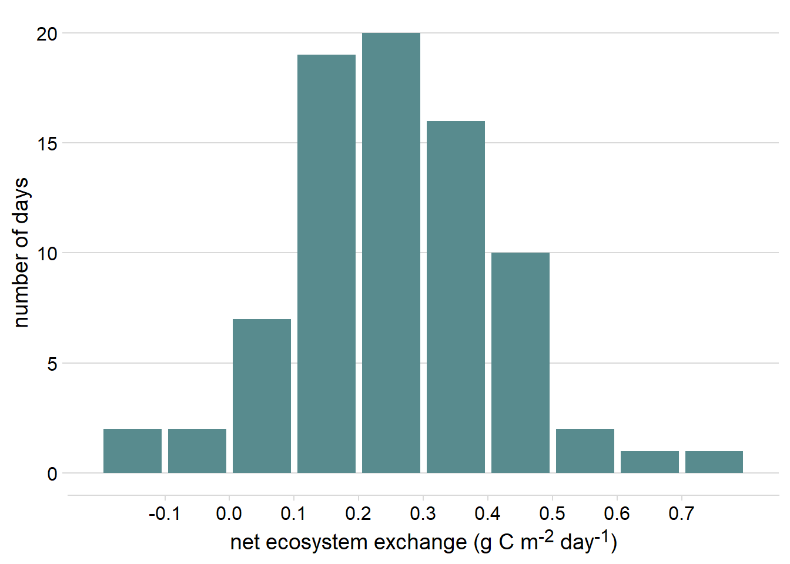
<p class="caption">(\#fig:histogram)Histogram of daily net ecosystem exchange of carbon dioxide (NEE) in February at the Konza Prairie Biological Station NEON site, 2019-2022</p>
</div>
</details>
\
<details>
<summary>Click here to see an example of geom_hex and ggMarginal code and plot.</summary>

```r
p <- ggplot(pheno_targets, aes(x = gcc_90, y = rcc_90)) +
  geom_hex(bins = 30)+
  geom_point(color = "transparent")+
  ylab("greenness index") + 
  xlab("redness index")+
  theme_cowplot()+
  scale_fill_continuous_sequential(palette = "BurgYl")+
  theme(legend.position = c(0.8, 0.8))
ggMarginal(p,type = "histogram", fill = "grey80", color = "white", bins = 30)
```

<div class="figure">
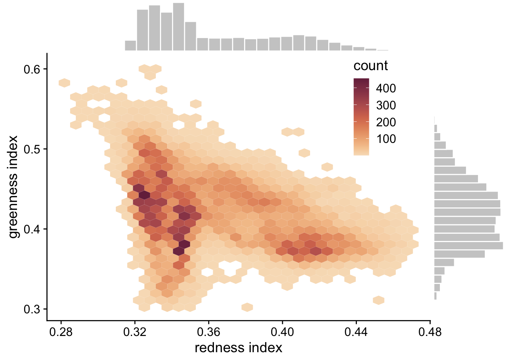
<p class="caption">(\#fig:histogram2D)Hexagonal heatmap showing the joint distribution of greenness chromatic coordinate and redness chromatic coordinate at the six NEON sites in the phenology forecast challenge.</p>
</div>
</details>

##### Density Plot
A **Density Plot** is a smoothed, continuous version of a histogram that displays the estimated probability distribution of a variable or parameter. Density plots are often used to visualize Bayesian prior and posterior distributions. When data or MCMC samples are involved, probability density is typically estimated using the “kernel density estimation” method, where the smoothness and shape of the density curve are controlled by the choice of bandwidth parameter and kernel, respectively (see [Wilke, 2019: Visualizing distributions: Histograms and density plots](https://clauswilke.com/dataviz/histograms-density-plots.html)).

* `geom_density` - in [ggplot2](https://ggplot2.tidyverse.org/) - plots density estimates for a single variable
* `geom_density_2d` - in [ggplot2](https://ggplot2.tidyverse.org/) - plots contours resulting from a 2D kernel density estimation
* `geom_function` - in [ggplot2](https://ggplot2.tidyverse.org/) - plots a function (e.g. dnorm)
* `geom_area` - in [ggplot2](https://ggplot2.tidyverse.org/) - can be used for a filled density plot
* `slab` and `halfeye`-  This vignette describes the [slab+interval geoms](https://mjskay.github.io/ggdist/articles/slabinterval.html#roadmap-it-all-starts-with-slabinterval-) and stats in [ggdist](https://mjskay.github.io/ggdist/).


<details>
<summary>Click here to see an example of geom_area code and plot.</summary>

```r
ggplot() +
  geom_area(data = tibble(x = seq(0.01, 4, 0.01), y = dlnorm(seq(0.01, 4, 0.01))), aes(x = x, y = y), fill = "grey80", color = "grey40")+
  xlim(c(0,4))+
  theme_minimal_hgrid()+
  ylab("probability density")+
  theme(axis.title.x = element_blank())
```

<div class="figure">
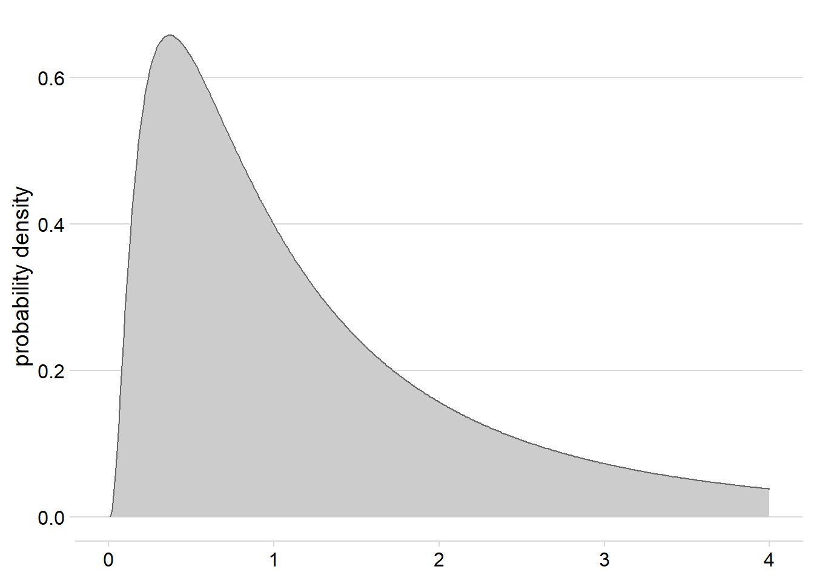
<p class="caption">(\#fig:density)Density plot for a log-normal distribution with mean = 0 and standard deviation = 1</p>
</div>
</details>


##### Dotplots
**Dotplots** show the individual observations of a distribution, either as continuous values or as part of binned intervals (similar to histograms). This type of visualization provides the finest scale of visualization for distributions that may be lost when using other common methods (i.e., histograms, density plots, boxplots). **Quantile Dotplots** are similar, except that the data are broken into quantiles, which are then binned and plotted such that each dot represents a single quantile rather than a single observation. Quantile dotplots are a way of visualizing distributions and uncertainty with a “frequency frame”, and have been shown to aid people in making decisions in the face of uncertainty ([Kay et al., 2016](https://dl.acm.org/doi/10.1145/2858036.2858558)).

* `geom_jitter` in [ggplot2](https://ggplot2.tidyverse.org/) - adds small amounts of variation to the location of each point to avoid overplotting when visualizing observations of a quantitative variable.
* `geom_dotplot` in [ggplot2](https://ggplot2.tidyverse.org/) - bins up observations and plots a single point for each observation.
* `stat_dots` from the [ggdist](https://mjskay.github.io/ggdist/) package - plots a single point for each binned observation by default, or produces a quantile dotplot if the quantiles argument is specified.

<details>
<summary>Click here to see an example of stat_dots code and plot.</summary>

```r
set.seed(123)
tempSample <- tibble(temp = rnorm(10000, mean = 17.7, sd = 1))
ggplot(tempSample, aes(x = temp, fill = stat(x > 19), color = stat(x > 19))) + 
  stat_dots(quantiles = 30)+
  geom_vline(xintercept = 19, linetype = 2, color = "gray50")+
  theme_cowplot() +
  xlab("Temperature (°C)")+
  scale_fill_manual(values = c("#517AC9", "#C05D5D"))+
   scale_color_manual(values = c("#517AC9", "#C05D5D"))+
  theme(legend.position = 'none',
        axis.title.y = element_blank(),
        axis.text.y = element_blank(),
        axis.line.y = element_blank(), 
        axis.ticks.y = element_blank())
```

<div class="figure">
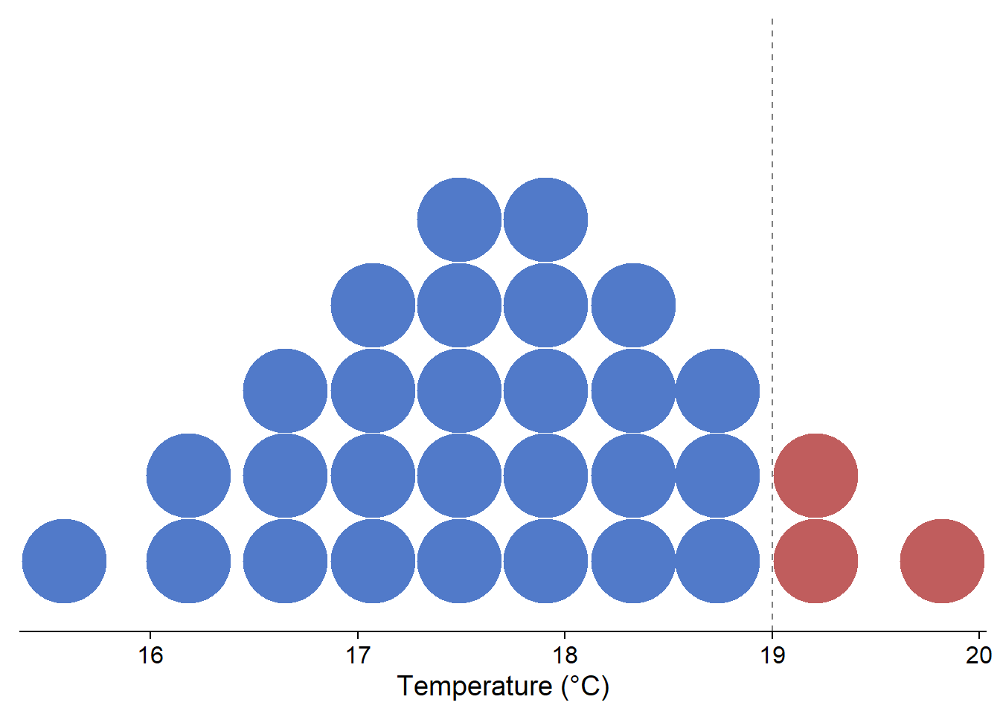
<p class="caption">(\#fig:qdotplot)Quantile dotplot showing the probability of temperature exceeding 19 °C for a theoretical, normally-distributed temperature forecast with mean = 17.7 °C and sd = 1</p>
</div>
</details>


##### Boxplots
**Boxplots** display common summary statistics for a distribution, which include the minimum, first quartile, median, third quartile, and maximum values. The ‘box’ displays the middle 50% of the distribution while the ‘whiskers’ display the remaining 50% in the tails of the distribution. Any values that fall outside of 1.5 times the length of the ‘box’ are typically drawn as points beyond the whiskers and are typically referred to as outliers. Similarly, **interval plots** typically show the median as a point and one or more lines or boxes whose widths represent quantiles of the distribution. Whereas the plots described above are useful for visualizing single distributions, boxplots, interval plots, violin plots, and ridgeline plots can display multiple distributions in the same plot ([Wilke, 2019](https://clauswilke.com/dataviz/)).

* `boxplot` in base R
* `geom_boxplot` in [ggplot2](https://ggplot2.tidyverse.org/)
* `interval` and `pointinterval` from the [ggdist](https://mjskay.github.io/ggdist/) package create stand-alone interval plots, whereas several other stats from the stat_slabinterval family allow one to add intervals to other plot types, including density plots, violin plots, histograms, and dotplots.

<details>
<summary>Click here to see an example of geom_boxplot code and plot.</summary>

```r
terrestrial_daily_targets %>% 
  drop_na(le) %>%
  filter(month(time) == 5,
         siteID %in% c("BART", "CLBJ", "KONZ", "ORNL", "OSBS")) %>%
  ggplot(aes(x = siteID, y = le))+
  geom_boxplot(fill = "#78A481") +
  theme_minimal() +
  xlab("NEON site") +
  ylab("latent heat flux (W m<sup>-2</sup>)")+
  theme(axis.title.y = element_markdown())
```

<div class="figure">
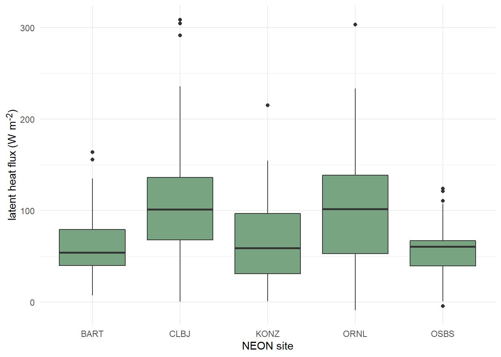
<p class="caption">(\#fig:boxplot)Distributions of daily latent heat flux during May at 5 NEON sites shown as boxplots.</p>
</div>
</details>


##### Violin Plots
**Violin plots** are an extension of a density plot where the density plot is mirrored and shows the minimum and maximum values, as well as the maximum point density region(s). Since they can show greater detail of a distribution, violin plots have often been used as a replacement for boxplots more recently.

* `geom_violin` in [ggplot2](https://ggplot2.tidyverse.org/)
* `pirateplot` from the [yarrr](https://bookdown.org/ndphillips/YaRrr/pirateplot.html) package
* `stat_eye` from the [ggdist](https://mjskay.github.io/ggdist/) package

<details>
<summary>Click here to see an example of geom_violin code and plot.</summary>

```r
terrestrial_daily_targets %>% 
  drop_na(le) %>%
  filter(month(time) == 5, 
         siteID %in% c("BART", "CLBJ", "KONZ", "ORNL", "OSBS")) %>%
  ggplot(aes(x = siteID, y = le))+
  geom_violin(fill = "#78A481") +
  theme_minimal() +
  xlab("NEON site") +
  ylab("latent heat flux (W m<sup>-2</sup>)")+
  theme(axis.title.y = element_markdown())
```

<div class="figure">

<p class="caption">(\#fig:violin)Distributions of daily latent heat flux during May at 5 NEON sites shown violin plots.</p>
</div>
</details>


##### Ridgeline Plots
**Ridgeline plots** show offset density plots for multiple variables. This can be useful for making comparisons of a given variable over space or time, as well as for comparing among a number of groups. However, it is not possible to directly compare the values on the y axis among density plots due to the three dimensional effect of this type of plot. Therefore, this method may be more useful when interested in relative (rather than absolute) densities.

* `geom_density_ridges` from the [ggridges](https://wilkelab.org/ggridges/) package
* `stat_halfeye` from the [ggdist](https://mjskay.github.io/ggdist/) package

<details>
<summary>Click here to see an example of geom_density_ridges code and plot.</summary>

```r
terrestrial_daily_targets %>% 
  drop_na(le) %>%
  filter(month(time) == 5, 
         siteID %in% c("BART", "CLBJ", "KONZ", "ORNL", "OSBS")) %>%
  ggplot(aes(x = le, y = siteID))+
  geom_density_ridges(fill = "#78A481") +
  theme_minimal() +
  ylab("NEON site") +
  xlab("latent heat flux (W m<sup>-2</sup>)")+
  theme(axis.title.x = element_markdown())
```

<div class="figure">
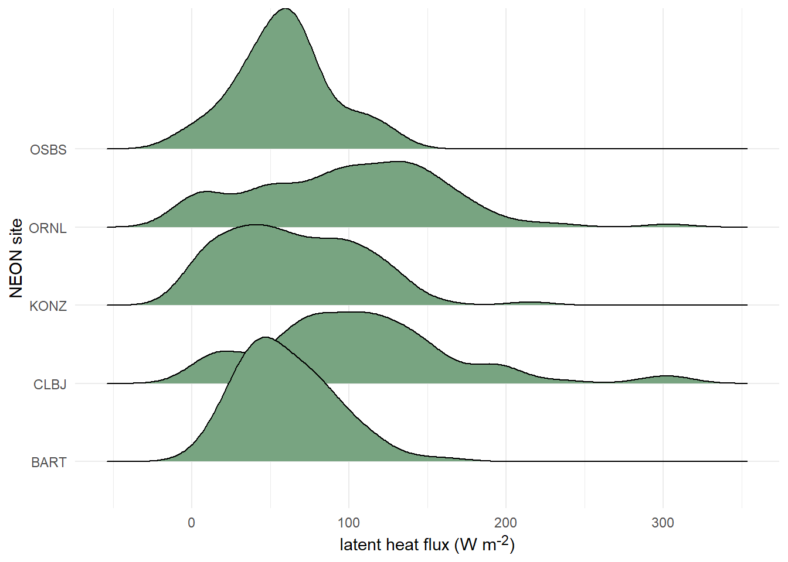
<p class="caption">(\#fig:ridgeline)Distributions of daily latent heat flux during May at 10 NEON sites shown as staggered density plots or 'ridgeline' plots.</p>
</div>
</details>
\

#### Point and line plots 
##### Scatterplots
**Scatterplots** are handy for visualizing relationships between two continuous variables. This includes **time series**, where the variable on the x-axis is time. The following tools are commonly used for making scatterplots: 

* The `plot` function from the base package in R defaults to producing a scatter plot 
* With [ggplot2](https://ggplot2.tidyverse.org/), the geometric object `geom_point` can be used

<details>
<summary>Click here to see an example of geom_point code and plot.</summary>

```r
aquatics_targets %>% 
  filter(year(time) <= 2020, 
         year(time) >= 2019,
         siteID == "POSE") %>%
  ggplot(aes(x = temperature, y = oxygen))+
  geom_point(size = 1.2)+
  ylim(c(7.5, 13.0))+
  xlim(c(0,25))+
  theme_minimal_grid()+
  ylab(expression(paste("dissolved oxygen (mg ", L^-1, ")")))+
  xlab("Temperature (°C)")
```

<div class="figure">
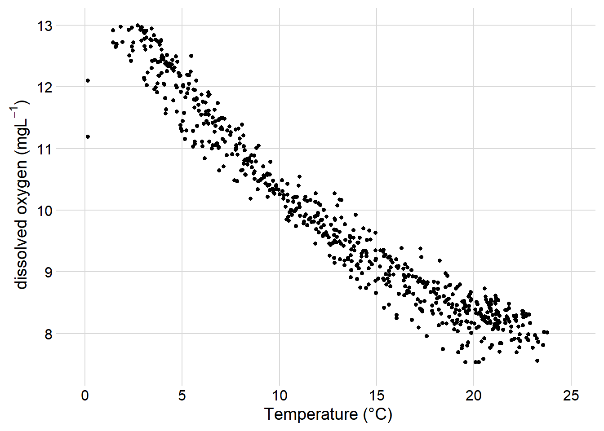
<p class="caption">(\#fig:scatterplot)Scatterplot of dissolved oxygen concentrations vs. temperature at the Posey Creek NEON site, 2019-2020</p>
</div>
</details>


##### Line Graphs
**Line Graphs** connect data points sequentially and are also commonly used for visualizing **time series**. It’s also possible to add lines to existing scatter plots to emphasize connections between the data while emphasizing the data themselves with points. The tools below are often used to create line graphs or add lines to existing plots:

* The `plot` function from the base package in R generates a line plot with the argument `type = “l”`
* The `lines` function in base R adds a line to an existing plot.
* With [ggplot2](https://ggplot2.tidyverse.org/), the geometric object `geom_line` (or `geom_path`) can be used to add lines.

<details>
<summary>Click here to see two examples of geom_line, with and without geom_point code, and the  plots.</summary>

```r
aquatics_targets %>% 
  filter(year(time) <= 2020, 
         year(time) >= 2019,
         siteID == "POSE") %>%
  ggplot(aes(x = time, y = oxygen))+
  geom_line()+
  theme_minimal_grid()+
  ylab(expression(paste("dissolved oxygen (mg ", L^-1, ")")))+
  theme(axis.title.x = element_blank())
```

<div class="figure">
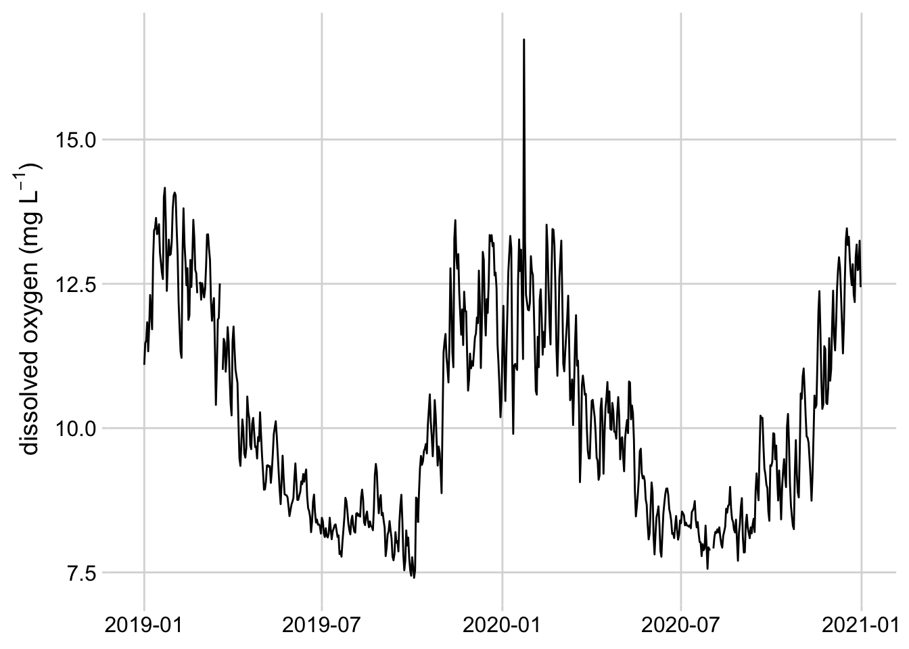
<p class="caption">(\#fig:line)Line graph of mean daily dissolved oxygen concentrations at the Posey Creek NEON site, 2019-2020</p>
</div>


```r
aquatics_targets %>% 
  filter(year(time) == 2021, 
         month(time) == 6,
         siteID == "POSE") %>%
  ggplot(aes(x = time, y = oxygen))+
  geom_line()+
  geom_point()+
  theme_minimal_grid()+
  ylab(expression(paste("dissolved oxygen (mg ", L^-1, ")")))+
  theme(axis.title.x = element_blank())
```

<div class="figure">
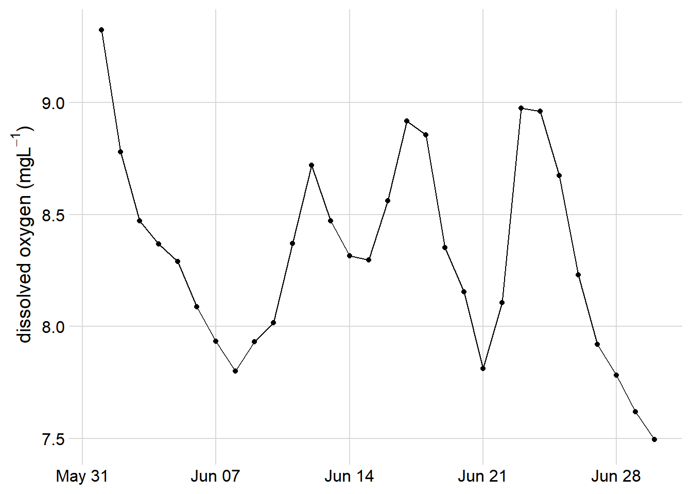
<p class="caption">(\#fig:pointline)Line graph with dots showing dissolved oxygen concentrations at the Posey Creek NEON site, June 2021</p>
</div>
</details>


##### Pairs Plots and Correlograms
**Pairs Plots** and **Correlograms** are useful for quickly visualizing relationships and correlations between several variables at once. These plots are typically used for exploratory data analysis.

* `pairs` function from base R - creates scatterplot for each combination of variables
* `ggpairs` from the [GGally package](https://cran.r-project.org/web/packages/GGally/index.html) - by default, displays the correlation between each combination of variables in the top right corner, a scatter plot for each combination of variables in the lower left corner, and a density plot for each variable on the diagonal. Several customization options are available.
* `corPlot` from the [psych package](https://cran.r-project.org/web/packages/psych/index.html) - displays the correlation between each combination of variables in a box, where the color hue of the box indicates whether the correlation is positive or negative and the color value indicates the strength of the correlation.

<details>
<summary>Click here to see an example of ggpairs code and plot.</summary>

```r
Sys.unsetenv("AWS_DEFAULT_REGION")
Sys.unsetenv("AWS_S3_ENDPOINT")
Sys.setenv(AWS_EC2_METADATA_DISABLED = "TRUE")

s3 <- arrow::s3_bucket(
  "drivers/noaa/neon/gefs",
  endpoint_override = "js2.jetstream-cloud.org:8001",
  anonymous = TRUE)

df <- arrow::open_dataset(s3)
fc <- df %>%
  filter(start_time == as.Date("2022-04-20"),
         site_id == "ORNL", 
         variable %in% c("TMP", "PRES", "RH", "DSWRF", "DLWRF", "UGRD", "VGRD")) %>%
  select(horizon, ensemble, variable, predicted) %>%
  collect() %>%
  pivot_wider(
    names_from = variable, 
    values_from = predicted, 
    values_fn = mean
  ) %>%
  mutate(wind_speed = sqrt(UGRD^2 + VGRD^2)) %>%
  rename(
    "air temperature" = TMP,
    "air pressure" = PRES,
    "longwave flux" = DLWRF,
    "shortwave flux" = DSWRF,
    "relative humidity" = RH,
    "wind speed" = wind_speed,
  )

fc[sample(nrow(fc), 300), ] %>%
 select("air temperature", "air pressure", "relative humidity", "wind speed", "longwave flux") %>%
 ggpairs()+
 theme_minimal_grid(font_size = 10)
```

<div class="figure">
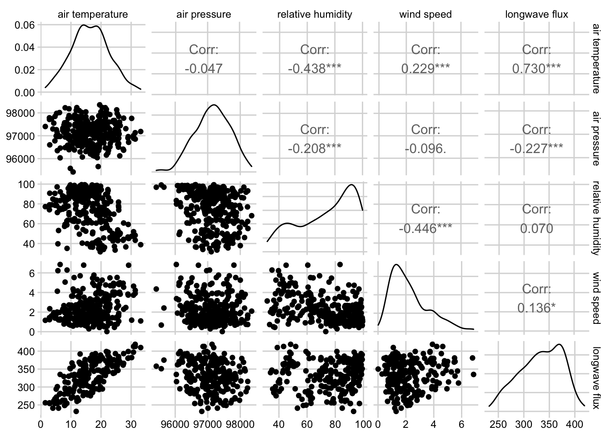
<p class="caption">(\#fig:pairs)Combined scatterplot matrix and correlation matrix for five weather variables from the noaa GEFS model at the Oak Ridge National Lab NEON site.</p>
</div>
</details>


#### Barplots and Heatmaps 
Barplots and Heatmaps are both used to visualize and compare quantities among one or more grouping variables. 

##### Barplots
**Barplots** encode quantities using bar length, where each bar represents a group. Stacked and grouped barplots allow for comparison among two different categorical variables.

* `barplot` from base R
* `geom_bar` and `geom_col` from [ggplot2](https://ggplot2.tidyverse.org/)

<details>
<summary>Click here to see an example of geom_col code and plot.</summary>

```r
tick_targets %>%
  filter(year(time) == 2019, month(time) == 6, siteID %in% c("UKFS", "TALL", "SERC", "ORNL", "KONZ")) %>%
  group_by(siteID) %>%
  summarize(`amblyomma_americanum` = mean(`amblyomma_americanum`)) %>%
  arrange(desc(`amblyomma_americanum`)) %>%
  mutate(siteID = factor(siteID, levels = siteID)) %>%
  ggplot(aes(x = siteID, y = `amblyomma_americanum`))+
  geom_col(fill =  "#7C7BB2" )+
  ylab("*Amblyomma americanum* density (ticks per 1600 m<sup>2</sup>)")+
  xlab("NEON site") +
  theme_minimal_hgrid()+
  theme(axis.title.y = element_markdown())
```

<div class="figure">

<p class="caption">(\#fig:barplot)Barplot showing the mean density of *amblyomma americanum* larvae observed in June 2019 at 5 NEON sites</p>
</div>
</details>


##### Heatmaps
**Heatmaps** encode quantities using color, where the x and y position of each block in the heatmap correspond to the first and second categorical variables, respectively.

* `heatmap` from base R
* `geom_tile` from [ggplot2](https://ggplot2.tidyverse.org/)

<details>
<summary>Click here to see an example of geom_tile code and plot.</summary>

```r
siteIDLevels <- beetle_targets %>%
  filter(year(time) >= 2017,
         year(time) <= 2019) %>%
  group_by(siteID) %>%
  summarise(meanRichness = mean(richness, na.rm = TRUE)) %>%
  arrange(meanRichness) %>%
  pull(siteID)
expand_grid(year = 2017:2019,
            month = 1:12, 
            siteID = unique(beetle_targets$siteID)) %>%
  mutate(monthYear = paste0(year, "-", if_else(nchar(month) == 1, paste0("0", month), as.character(month)))) %>%
  left_join(beetle_targets %>%
    mutate(month = month(time),
         year = year(time), 
         monthYear = paste0(year, "-", if_else(nchar(month) == 1, paste0("0", month), as.character(month)))) %>%
    filter(year >= 2017, year <= 2019),
  by = c("siteID", "monthYear")) %>%
  mutate(siteID = factor(siteID, levels = siteIDLevels)) %>%
ggplot(aes(x = monthYear, y = siteID)) +
  geom_tile(width = 0.9, height = 0.9, aes(fill = richness)) + 
  theme_cowplot(font_size = 12)+
  scale_fill_viridis(option = "B", na.value = "#BBBBBB", direction = -1, end = 0.9) +
  ylab("site")+
  theme(axis.line = element_blank(),
        axis.ticks = element_blank(), 
        axis.title.x = element_blank(),
        axis.text.x = element_blank(),
        panel.background = element_rect(fill = "white"),
        axis.text.y = element_text(size = 9)) +
      coord_cartesian(clip = 'off') +
annotate("text", 
         x = c(6, 18, 30), 
         y = c(-3.7, -3.7, -3.7), 
         label = c("2017", "2018", "2019")) +
  annotate("segment", 
           x = 1, xend = 12, y = -2.8, yend = -2.8) + 
  annotate("segment", 
           x = 13, xend = 24, y = -2.8, yend = -2.8) + 
  annotate("segment", 
           x = 25, xend = 37, y = -2.8, yend = -2.8) + 
annotate("text",
         x = 1:36,
         y = rep(-1, times = 36),
         label = rep(c("Jan", "Feb", "March", "April", "May", "June", "July", "Aug", "Sept", "Oct", "Nov", "Dec"), times = 3),
         angle = '90', 
         size = 3)
```

<div class="figure">
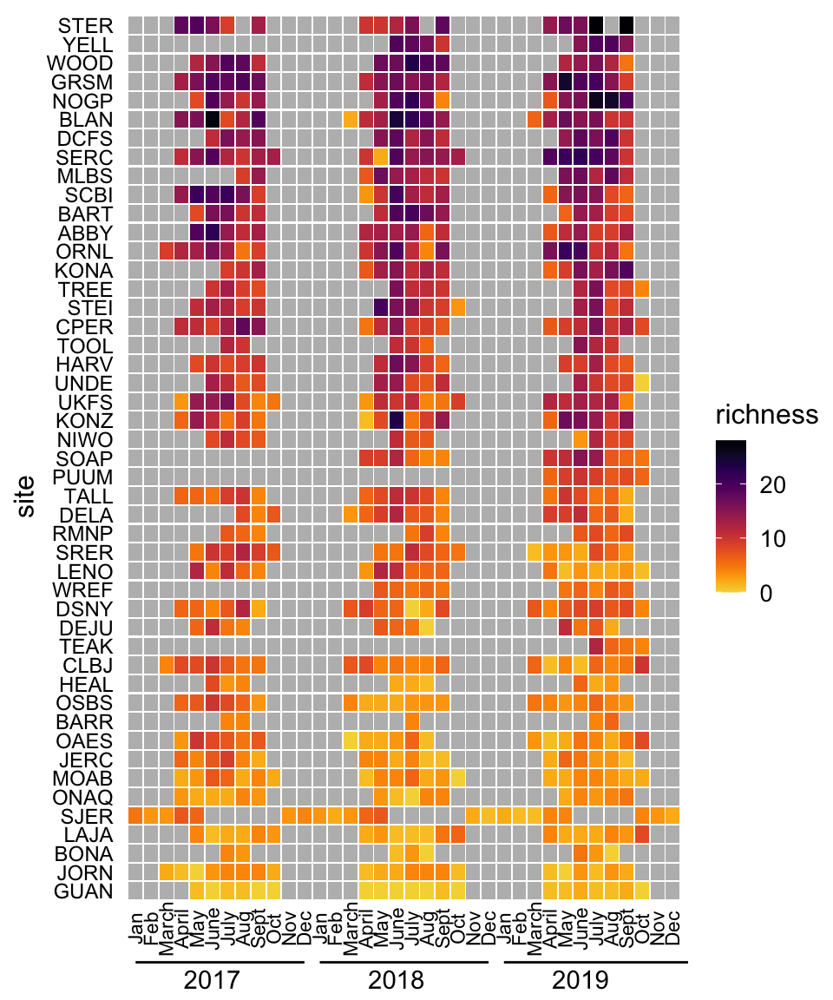
<p class="caption">(\#fig:heatmap)Heatmap of monthly beetle species richness observations at 47 NEON sites, 2017-2019.</p>
</div>
</details>


##### Composite plots
**Composite plots** are created by combining multiple plots into the same graphic.

* `facet_wrap` and `facet_grid` in [ggplot2](https://ggplot2.tidyverse.org/) - breaks the data into groups based on one or more grouping variables and displays a plot for each group
* `plot_grid` from the [cowplot](https://wilkelab.org/cowplot/articles/plot_grid.html) package
* The [patchwork](https://patchwork.data-imaginist.com/) package 
* `grid.arrange` from the [gridExtra](https://cran.r-project.org/web/packages/gridExtra/index.html) package

<details>
<summary>Click here to see an code combining two plots into the same graphic.</summary>

```r
filteredData <- pheno_targets %>%
  filter(siteID == "HARV", 
         year(time) == 2021) 
red <- ggplot(filteredData, aes(x = time, y = rcc_90))+
  geom_line(color = "#841859") + 
  ylab("redness index")+
  theme_minimal_grid()+
  theme(axis.title.x = element_blank())
green <- ggplot(filteredData, aes(x = time, y = gcc_90))+
  geom_line(color = "#005600") + 
  ylab("greenness index")+
  theme_minimal_grid()+
  theme(axis.title.x = element_blank())
red + green+ plot_layout(nrow = 2, byrow = FALSE)
```

<div class="figure">
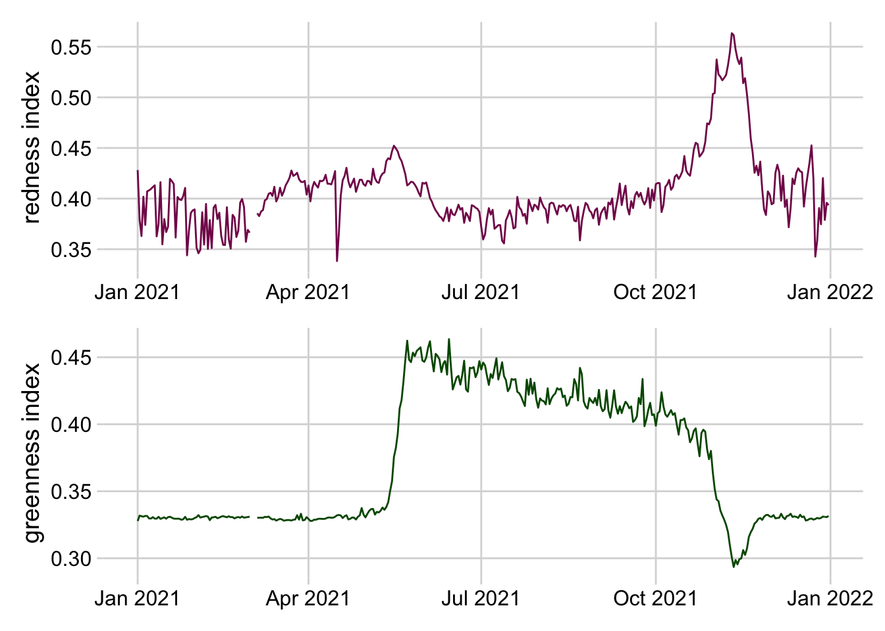
<p class="caption">(\#fig:facet)Stacked line plots of greenness and redness index at the Harvard Forest NEON site in 2021.</p>
</div>
</details>


#### References 
**R**

* [Fundamentals of Data Visualization](https://clauswilke.com/dataviz/)
* [From data to Viz | Find the graphic you need](https://www.data-to-viz.com/)
* [Welcome | ggplot2](https://ggplot2.tidyverse.org/)
* [R Graphics Cookbook, 2nd edition](https://r-graphics.org/)
* [3 Data visualisation | R for Data Science](https://r4ds.had.co.nz/data-visualisation.html)
* [28 Graphics for communication | R for Data Science](https://r4ds.had.co.nz/graphics-for-communication.html)

**Python**

* [Introduction to Data Visualization in Python | by Gilbert Tanner](https://towardsdatascience.com/introduction-to-data-visualization-in-python-89a54c97fbed)
* [Chart Visualization — pandas 1.3.4 documentation](https://pandas.pydata.org/pandas-docs/stable/user_guide/visualization.html#)
* [Usage Guide — Matplotlib 3.4.3 documentation](https://matplotlib.org/stable/tutorials/introductory/usage.html#sphx-glr-tutorials-introductory-usage-py)
* [seaborn: statistical data visualization — seaborn 0.11.2 documentation](https://seaborn.pydata.org/)

**Julia**

* [Plotting Backends](https://docs.juliaplots.org/latest/backends/#backends)
* [StatsPlots](https://github.com/JuliaPlots/StatsPlots.jl)


### Animated Visuals
Gif, video, and other animations are a powerful way to communicate complexity and patterns where static visualizations may fall short. Animations provide an additional dimension that can allow an audience to [see progression in data over time](https://ebird.org/science/status-and-trends/abundance-animations) or depth, [track changes](https://observablehq.com/@d3/bar-chart-race), or [layer in additional information to support narration](https://labs.waterdata.usgs.gov/visualizations/snow-to-flow/index.html#/). This may be useful to avoid overwhelming a viewer and guide the audience’s attention to specific data points. Further, whereas static, 2D representations of 3D objects [are difficult to interpret](https://clauswilke.com/dataviz/no-3d.html), animated representations where the object is rotated and displayed at different angles allow viewers to create [a mental reconstruction](https://www.tylermw.com/3d-maps-with-rayshader/) of the 3D object. Finally, animation can be used to convey uncertainty using hypothetical outcome plots (HOPs), which are animated sequences of plots where each plot represents a random draw from an underlying distribution. Research suggests that HOPs lead to better understanding of uncertainty and more accurate judgments about differences between multiple random variables ([Hullman et al., 2015](https://journals.plos.org/plosone/article?id=10.1371/journal.pone.0142444); [Kale et al., 2019](https://ieeexplore.ieee.org/document/8440816)). See more details about HOPs in the [Uncertainty Visualization section](#Uncertainty-Visualization).

#### Animation tools

* [gganimate package](https://gganimate.com/)
  + Transitions define how animations are mapped to data 
  + `transition_time` transitions data through time, with the duration of each frame relative to the distance in time 
  + `transition_reveal` gradually reveals data 
  + `transition_states` animates between distinct stages or groups 
* [rayshader package](https://www.rayshader.com/)
  + Create movies of camera moving around 3D maps and ggplots with `render_movie`. Camera path around visualization can be custom defined. 
* [ImageMagick (CLI)](https://imagemagick.org/script/command-line-tools.php) / [Magick (R)](https://github.com/ropensci/magick) 
  + Manipulate images (rotate, scale, crop, trim, flip, blur, etc) and stitch into animation (`image_animate` in R).
* [gifski package](https://cran.r-project.org/web/packages/gifski/index.html)
  + Sequence any series of frames into a gif using `gifski` 
* Convert gifs to video 
  + ['gif and animate'](https://docs.juliaplots.org/latest/animations/) macros in Julia
    + gif creates an animated gif file. Use this for simple, one-off animations.
    + animate returns and Animation object for later processing. Use this for anything complex or when you need full control of the life-cycle of the animation
  + [ImageIO](https://pypi.org/project/imageio/) - Python package


### Interactive and Reactive Features

**Interactive data visualizations** are particularly useful when you find yourself with more information than can realistically be included in a single visualization. Interactive features give control to the end-user, allowing them to access details associated with a particular plot feature or even customize the data being plotted. Common interactive features include those that allow users to zoom and pan over an image, hover or click on features to access tooltips with additional information, and hover over a single object to highlight the entire group to which it belongs. **Reactive visualizations** are a special type of interactive visualization where user input changes the information or data being displayed. Reactivity can allow users to do things like filter data to visualize subsets of interest, modify which variables are plotted, and customize how the data is plotted (e.g. histogram bin size, color palette).  

Here are some principles to consider when developing interactive research products.

1. Scientists developing interactives should understand their users, uses, and usage (impact). 
2. Interactives should be developed and disseminated in the open whenever possible.
3. Funders should develop and enforce standards for interactives as scholarly products.
4. Organizations and communities of practice should enable discovery by improving findability.
5. Organizations should reward researchers for creating useful interactives through existing incentivization structures.
6. Publishers and funding agencies should create and enact publication standards.

	
#### Interactive tools
* [Plotly](https://plotly.com/) (standard types of plots, 3D plots, etc) is a javascript visualization library with wrappers for R, Python, Julia, Matlab.
  + [ggplotly](https://plotly.com/ggplot2/) is a function within the [plotly](https://plotly.com/r/) R package for making ggplot graphics interactive 
  + Resource for working with plotly in R - [Interactive web-based data visualization with R, plotly, and shiny](https://plotly-r.com/)
* [Highcharter](https://jkunst.com/highcharter/) is an R wrapper for the Highcharts javascript library and its modules. Highcharts is a flexible and customizable javascript charting library and it has a great and powerful API.
  + Examples and details about highcharter can be found [here](https://jkunst.com/highcharter/)
* [Charter](https://github.com/JohnCoene/charter) is an R wrapper for the [Charts](https://www.chartjs.org/) javascript library
* [echarts4r](https://echarts4r.john-coene.com/index.html) is an R wrapper for the [Apache eCharts](https://echarts.apache.org/en/index.html) javascript library
* [ggiraph](https://davidgohel.github.io/ggiraph/index.html) is an R package for making ggplot graphics interactive
* [Dygraphs](https://dygraphs.com/) is an open source JavaScript charting library. It can handle large data sets (plots millions of points without getting bogged down), provides strong support for error bars and confidence intervals, and is highly customizable.
* The [rgl](https://dmurdoch.github.io/rgl/) and [rayshader](https://www.rayshader.com/) packages in R allow the creation of interactive 3D plots.

#### High-level Reactive tools 

High-level reactive tools provide figures or graphs that change as a function of user input.

* [Tableau](https://www.tableau.com/) - is a subscription-based visualization tool that’s popular in the data viz community. Students and instructors may obtain free licenses to use it. Making visually compelling figures and plots is relatively easy with the powerful graphical user interface. Basically, you create a visualization using drag and drop. Dashboard and interactive visualization can be created and shared. With public data, one can share them via [Tableau Public](https://public.tableau.com). [COVID-19 in Florida](https://covid19florida.mystrikingly.com/) is one example that uses the Tableau Public platform, which has been well utilized over the COVID-19 pandemic to disseminate information due to its ease in creating great visualizations.
* [PowerBI](https://powerbi.microsoft.com/en-us/) - is in many cases similar to Tableau, featuring an easy to use graphical user interface that allows us to create visualizations. Power BI is well integrated with Microsoft, particularly suitable for people who're already using Azure and Office in their workflow. While Power BI Desktop is free, a subscription-based Power BI Pro is required to publish and share the visualization created. 
* [Observable](https://observablehq.com/) - is a Javascript based interactive notebook that allows you to create interactive visualizations based on reader’s input. Observable makes it easier to program in Javascript and to utilize the D3 library to make visually compelling plots. The notebook can be published and shared to the public. It is free for individuals, but collaboration beyond five persons requires paid subscriptions.

* [Dash](https://dash.plotly.com/r/introduction) - is a framework for building and deploying data apps with customized user interfaces in Python, R, Julia, and F# (experimental). 
* [Shiny](https://shiny.rstudio.com/) - is an R package that makes it easy to build interactive web apps straight from R. You can host standalone apps on a webpage or embed them in R Markdown documents or build dashboards. You can also extend your Shiny apps with CSS themes, htmlwidgets, and JavaScript actions.
  + This [webpage of Shiny resources](https://lsw5077.github.io/shiny_workshop/resources.html) provides example apps in Ecology, Conservation, and Epidemiology, links to Shiny and R programming resources, and statistical modeling, a Bayesian course, and Tidymodels
  + EFI hosted a [4-part seminar series](https://ecoforecast.org/workshops/r-shiny-seminar-series/) on R Shiny applications and the associated code needed for the applications. The applications included:
    + [Visualization of Data in Space and Time: An Interactive Framework](https://ecoforecast.org/workshops/r-shiny-seminar-series/#space-time)
    + [Creative Visualization of Model Results and Uncertainty in Shiny](https://ecoforecast.org/workshops/r-shiny-seminar-series/#uncertainty-viz)
    + [Improving Speed of Shiny Apps by Pre-Computing Models](https://ecoforecast.org/workshops/r-shiny-seminar-series/#pre-compute)
    + [A Primer to Creating Interactive Maps with Leaflet in Shiny](https://ecoforecast.org/workshops/r-shiny-seminar-series/#leaflet)
* [Interact.jl](https://github.com/JuliaGizmos/Interact.jl) - is a Julia package for creating web-based widgets

See [Table 3 (below)](#Table-3) for a list of web-application development frameworks.


### Geospatial Visuals
Spatial datasets contain information that links the data to physical/geographic locations. Because spatial data has extra information, visualization, modeling, and manipulating spatial data requires special file formats, projections, and geospatial operations. We will briefly describe these here, but refer to existing resources on Geographic Information Systems (GIS) and working with static spatial data. 
[Geocomputation with R](https://geocompr.robinlovelace.net) is an online book on geographic data analysis, visualization and modeling

#### File Formats
Files containing spatial data need to convey the spatial coordinates and how coordinates in geographic space are mapped onto a flat map surface. Thus, these data are often stored in different file formats than non-spatial data. 

* **Vector:** A vector stores spatial data in a vector format (as opposed to gridded), such as in points, lines, and polygons
  + [geojson.io](http://geojson.io/about.html) - json or text based standard that is commonly sent with APIs. geojson.io is a fast, simple tool to create, change, and publish maps using geojson data
  + [geopackage](https://www.geopackage.org/) - based on SQLite (derived from spatialite and updated for OGC standard compliance)
  + [Shapefile](https://en.wikipedia.org/wiki/Shapefile) - this is a widely adopted ArcGIS format; requires multiple files (shp, shx, dbf, etc) to be complete, often combined into a single zip
* **Raster:** Raster file formats store spatial data in pixels along a regular grid.
  + There are a variety of different raster file formats, including GeoTIFF, ASCII, netcdf, cloud optimized geotiff, etc

#### Projections and Coordinate Reference Systems (CRS)
Projections and coordinate reference systems both contain information about how spatial data can be visualized, and where it is, with important differences. 
Geographic Coordinate Reference Systems contain information on how spatial data is projected or placed on the Earth’s surface. 

* [ESPG codes](https://support.virtual-surveyor.com/en/support/solutions/articles/1000261353-what-is-an-epsg-code-) are often used to refer to different coordinate reference systems
* Most spatial data formats (shapefiles, rasters, etc) store the geographic coordinate system with the data, so users only need to worry about this if they wish to switch the Geographic Coordinate Reference System to match that of another spatial dataset. 
Additional information about Geographic Coordinate Systems (where the data is located on earth) and Projected Coordinate Systems (how the data is drawn on a flat surface) can be found in this [ArcGIS blog post](https://www.esri.com/arcgis-blog/products/arcgis-pro/mapping/gcs_vs_pcs).

#### Static Spatial Visualization
Often, we need to visualize data and/or forecasts distributed in geographic space. Here we list some static spatial visualization tools in R and Python which can be helpful to open, work with, and visualize spatial data. These packages and tools may help when dealing with issues specific to geospatial data, for example, opening geospatial file types, making maps with appropriate spatial projections, plotting different spatial data types including gridded raster data and polygons and other shapefiles.

##### Geospatial operations & tools for working with spatial data:
Many of the software programs commonly used in ecological forecasting have capabilities to work with geospatial data. Here we provide links to these resources and packages

* [ArcGIS](https://www.esri.com/en-us/arcgis/about-arcgis/overview) - requires a purchased license to operate, although often academic, government, and industry organizations make ArcGIS available to students or employees
* [QGIS](https://www.qgis.org/en/site/) - is free and open source
* R packages
    + [raster](https://cran.r-project.org/web/packages/raster/index.html) - contains useful functions for working with, manipulating, and visualizing rasters in R. The R community is moving towards deprecating this tool in favor of terra
    + [terra](https://cran.r-project.org/web/packages/terra/index.html) - is primarily a faster version of the raster package built by the same author but also handles some aspects of vector data. Currently terra is suggested for use over raster, but may have some compatibility issues with other packages. The raster package is [still suggested](https://gis.stackexchange.com/questions/413105/terrarast-vs-rasterbrick-for-loading-in-nc-files) when working with netCDF files that have multiple layers.
    + [maps](https://cran.r-project.org/web/packages/maps/index.html) - draws geographical maps
    + [sf](https://cran.r-project.org/web/packages/sf/index.html) - supports a standardized way to encode spatial vector data. Binds to 'GDAL' for reading and writing data, to 'GEOS' for geometrical operations, and to 'PROJ' for projection conversions and datum transformations.
    + [sp](https://cran.r-project.org/web/packages/sp/index.html) - is now [deprecated](https://twitter.com/edzerpebesma/status/1272928917700165633?s=20&t=teYNasm0f5dKabpt4IMpKg) in favor of the sf package. This [wiki page](https://github.com/r-spatial/sf/wiki/Migrating) contains some equivalent commands between packages.
    + [tmap](https://cran.r-project.org/web/packages/tmap/vignettes/tmap-getstarted.html) - generates thematic maps. The syntax for creating plots is similar to that of ggplot2, but tailored to maps. 
    + [ncdf4](https://cran.r-project.org/web/packages/ncdf4/index.html) is a package for working with netCDF files in R
    + [stars](https://cran.r-project.org/web/packages/stars/index.html) - used to read, manipulate, write and plot spatiotemporal arrays with space and time array dimensions
    + [rgdal](https://cran.r-project.org/web/packages/rgdal/index.html) provides bindings to the 'Geospatial' Data Abstraction Library ('GDAL') (>= 1.11.4) and access to the projection/transformation operations from the 'PROJ' library. ***Note that 'rgdal' will be retired by the end of 2023*** so plan to transition to sf/stars/terra functions using 'GDAL' and 'PROJ' at your earliest convenience. 

* Python
    + [Rasterio](https://rasterio.readthedocs.io/en/latest/)
    + [GeoPandas](https://geopandas.org/en/stable/)
    + [Pysal](https://github.com/pysal)
    + [Xarray:](https://xarray.pydata.org/en/stable/) - useful for working with netCDF files 

#### Types of Plots for Spatial Data


1. A **choropleth map** links polygons (e.g., counties, states, etc.) to values of a variable in a dataset using color or symbols. See an [example here](https://www.cdc.gov/dhdsp/maps/national_maps/hd_all.htm).
2. Proportional or graduated symbol maps use symbols scaled either proportionally to values of a variable or based on classifications of a variable. See an [example here](https://www.cdc.gov/dhdsp/maps/gisx/mapgallery/mi_cvd_deaths.html).
3. A **dot map** uses points to show the distribution of data spatially. Dots can be either at specific xy coordinates, or evenly distributed within an area of interest depending on the intent. See an  [example here](https://www.cdc.gov/dhdsp/maps/gisx/mapgallery/mn_stroke_registry.html). 
4. An **isopleth map** uses contours to connect identical values on a map and show the distribution of a variable spatially. See an [example here](https://www.cdc.gov/dhdsp/maps/gisx/images/thematic-maps.jpg). 
5. **Cartograms** are maps that scale polygons (e.g., counties, states, etc.) based on the values of a variable. Similar conceptually to a proportional symbol map, but the underlying map features themselves are scaled instead of a point layer on top. See an [example here](https://www.esri.com/news/arcuser/0110/cartograms.html). 
6. **Dasymetric maps** type refine chloropleth maps using additional information to make the spatial distribution of mapped values more accurate. 
7. Reference for all the plot examples above: [https://www.cdc.gov/dhdsp/maps/gisx/resources/thematic-maps.html](https://www.cdc.gov/dhdsp/maps/gisx/resources/thematic-maps.html) 
 
#### Interactive Spatial Visualization
Many spatial datasets contain additional dimensions that can be represented in visualizations. For example, a dataset might have both spatial and temporal information, and you want to visualize how the geographic patterns in the data change over time, or visualize how different scenarios can change geographic distribution of your data. These tools provide some capability to create interactive spatial visualization:

##### Tools to create interactive maps:**

* [ArcGIS Online](https://www.arcgis.com/index.html) - again requires a purchased license which may be available through your institution 
* [QGIS](https://www.qgis.org/en/site/) - has a QGIS2Web plugin. Here is a [tutorial](https://www.qgistutorials.com/en/docs/3/web_mapping_with_qgis2web.html) for the plugin.
* R
  + [Shiny](https://shiny.rstudio.com/) - R package to create interactive web apps including maps
  + [Plotly](https://plotly.com/r/) - a graphing library in R that can be used to make maps
  + [geom_sf()](https://ggplot2.tidyverse.org/reference/ggsf.html) for [ggplot2](https://ggplot2.tidyverse.org/)
  + [rasterVis](https://oscarperpinan.github.io/rastervis/) package to plot rasters more effectively in R
* [Leaflet](https://rstudio.github.io/leaflet/) is an open-source javaScript library for interactive maps. Leaflet can be used on its own or with Shiny.
* [Mapbox](https://www.mapbox.com/) is a mapping platform for building custom, interactive maps that can be embedded into web applications. Mapbox also provides a variety of vector and raster tilesets (e.g. roads, satellite imagery) and a geocoding API.
* [Panoply](https://www.giss.nasa.gov/tools/panoply/) is a stand alone netcdf visualizer for local or remote catalogs

### Uncertainty Visualization
Communicating forecast uncertainty can play a critical role in both aiding decision-makers and building and maintaining public trust. When depicting uncertainty, it is important to consider the audience, their numeracy, and their level of training in statistics. Below we briefly discuss several methods for visualizing uncertainty and present tools that can be used to implement each.

* **Error bars** are commonly used to depict uncertainty in the scientific community. When using error bars, it is important to clearly specify what the error bar represents, since error bars can be used to represent different measures of uncertainty (e.g. standard deviations, standard errors, confidence intervals, prediction intervals). Because interpreting many of these uncertainty measures requires a firm grasp of statistics, using error bars can lead to misinterpretation or inappropriate inference, especially by lay audiences ([Hofman et al., 2020](https://doi.org/10.1145/3313831.3376454); [Joslyn & LeClerc, 2012](https://doi.org/10.1037/a0025185); [Franconeri et al., 2021](https://doi.org/10.1177/15291006211051956)).
  + [`geom_errorbar`](https://ggplot2.tidyverse.org/reference/geom_linerange.html) in [ggplot2](https://ggplot2.tidyverse.org/)
  + [`geom_ribbon`](https://ggplot2.tidyverse.org/reference/geom_ribbon.html) in [ggplot2](https://ggplot2.tidyverse.org/) - analogous to an error bar but for lines rather than points
  + `point_interval` from [ggdist](https://mjskay.github.io/ggdist/) package
* Depicting a full **distribution** rather than summarizing it using an error bar can be an effective way to vizualize uncertainty. Compared to error bars, distribution visualizations provide the viewer with more information and have been linked to better decision making ([Franconeri et al., 2021](https://doi.org/10.1177/15291006211051956)). See the Distributions section above for tools.
* Uncertainty can also be mapped to different visual channels, including color value or **luminance, fuzziness, size, transparency, and location** ([MacEachren et al., 2012](https://doi.org/10.1109/TVCG.2012.279)). These channels can be particularly useful when both x and y positions are already being used to represent another aspect of the data (e.g. on a map). However, these visual channels are less precise than encoding uncertainty with position, as in the case of error bars and distributions ([Franconeri et al., 2021](https://doi.org/10.1177/15291006211051956)).
  + In ggplot the `aes()` function can be used to map the fill, size, and alpha aesthetics to uncertainty. 
  + Uncertainty can be mapped to fuzziness using the `with_blur()` function from [ggfx](https://ggfx.data-imaginist.com/) package
* **Value-suppressing uncertainty palettes** leverage the fact that color hues are easier to tell apart when they are saturated and darker ([Correll et al., 2018](https://doi.org/10.1145/3173574.3174216)). Such palettes map a variable of interest to color hue, and uncertainty to color saturation and luminance. The result is that values associated with high levels of uncertainty are more difficult to ascertain. Value-suppressing uncertainty palettes can be applied to visualizations like choropleth maps and heatmaps.
  + [multiscales](https://github.com/clauswilke/multiscales) package for ggplo2 is an experimental package that can help visualize uncertainty
* Another approach to visualizing uncertainty is to re-frame probabilities (e.g. 10%) as frequencies (e.g. 1 in 10). This can be an effective way to communicate uncertainty to a broader audience, including individuals with low numeracy.  ([Peters et al., 2010](https://journals.sagepub.com/doi/full/10.1177/0272989X10391672); [Franconeri et al., 2021](https://doi.org/10.1177/15291006211051956)). Several plot types take advantage of this so-called **“frequency-framing”** approach, which allows viewers to infer probability from visual representations of frequency: 
  + **Quantile dotplots** depict distributions by representing individual quantiles of the data as dots. Quantile dotplots have been shown to aid people in making decisions in the face of uncertainty ([Kay et al, 2016](https://dl.acm.org/doi/10.1145/2858036.2858558)).
    + `stat_dots` from the ggdist package produces a quantile dotplot if the quantiles argument is specified.
  + **Icon arrays** depict ratios with a frequency-frame by depicting a large number of icons and coloring them according to one or more variables.
    + [riskyr](https://hneth.github.io/riskyr) package
    + [ggwaffle](https://github.com/liamgilbey/ggwaffle) package
  + Visualizing individual data points, ensemble members, or samples from a distribution can convey uncertainty more intuitively while providing a more nuanced representation of the data underlying a distribution.([Weissgerber et al 2015](https://doi.org/10.1371/journal.pbio.1002128); [Franconeri et al., 2021](https://doi.org/10.1177/15291006211051956))
    + `geom_jitter` in ggplot can be used to avoid overplotting when plotting several individual data points 
  + **Hypothetical outcome plots** (or HOPs) are animated sequences of plots where each plot represents a random draw from an underlying distribution. Research suggests that HOPs lead to better understanding of uncertainty and more accurate judgments about differences between multiple random variables ([Hullman et al., 2015](https://journals.plos.org/plosone/article?id=10.1371/journal.pone.0142444); [Kale et al., 2019](https://ieeexplore.ieee.org/document/8440816)).
    + See tools for [Animated Visuals above](#Animated-Visuals).

#### Other Resources for Uncertainty Visualization
* [Fundamentals of Data Visualization](https://clauswilke.com/dataviz/visualizing-uncertainty.html) - section 16 specifically discusses visualizing uncertainty
* [The Science of Visual Data Communication](https://journals.sagepub.com/stoken/default+domain/10.1177%2F15291006211051956-FREE/full) - an overview of approaches to uncertainty visualization
* [ggdist](https://mjskay.github.io/ggdist/) package
* [ungeviz](https://github.com/wilkelab/ungeviz) package 
* [Recording](https://youtu.be/LTSKrtyzALM) of a panel hosted by the EFI Social Science Working group on visualizing uncertainty in forecasts including the use of color in NOAA weather maps

## Tables 

### Table 1 - End-Users

**Table 1: Considerations for end-users, life expectancy and sustainability of the app, interface outputs, communicating to end-users and feedback, and app maintenance and updates.**

|**Consideration**  | **Description** | **Recommendations**  | **Benefits** | **Consequence of Ignoring** | 
|------------- | --------------------------------- | ------------------------- | -------------------------------------------- | ---------------------- |
| End-users | Who is my end-user? (Arguably the most important questions) |     | Identify potential communities with which to communicate throughout the process. Design the interface for the anticipated end-users. Reach out to the anticipated end-users to identify needs, skills, etc. Make it easier to streamline the dissemination process. | Creating a product that has no clear end-users | 
| End-users | What are the needs of my end-users? | Ask potential end-users. | Improve chances of actually meeting the needs of end-users. Improve broader impacts of your research. | Fail to meet the needs of the end-users. | 
| End-users | What are the skills or prior knowledge of my end-users? | Ask end-users or always assume that end-users have the minimal amount of skills or prior knowledge, but don't "dumb it down". | Make your interface easier to use by stakeholders. Make the content more easily interpretable. Opportunity to create different options for end-users with varying skills, while keeping the barrier to entry low for users without certain skills. | Isolating end-users without necessary skills or knowledge may lead to non-adoption. | 
| Life expectancy and sustainability | How long will this application be relevant to end-users?  |  |  |  | 
| Life expectancy and sustainability| How will I ensure the application is available for that period of time? |  |  |  | 
| Life expectancy and sustainability | What are the costs (time, money, bytes) associated with hosting or storing for this period of time? |  |  |  | 
| Life expectancy and sustainability | Where will this application be located in 1 years time? 5? 10? | Consider storing the source code for your application within a trusted digital repository. Consider using persistent identifiers for released versions. Be certain you will always have access to the host location (e.g., website), and if there are associated fees consider whether you anticipate to always pay the hosting fees. | Releasing the initial version and each thereafter requires only a single location (URL, URI, DOI) to maintain and to share. | Changing the location (e.g., URL) of an application will be to the detriment of the usage of your application. If you publish the first release of this software inside a research journal article, but change the location some months or years down the road, it will render the intial reference useless. Will also add another layer to the findability of your application. | 
| Interface outputs | What is the purpose of the interface? |  |  |  | 
| Interface outputs | How will information be exported from the interface? |  |  |  | 
| Communication | How will I communicate to potential end-users? | If you have identified the end-user types or individuals, then a communication plan becomes more constrained. Consider how effective communication through various outlets will be. Will a research article reach your intended audience? How about a Tweet? How about an email to certain individuals? |  |  | 
| Communication | Will I provide an option for feedback on the interface? If so, how? | The easier it is for the end-user to provide feedback, the higher the probability is that the end-user will supply it. |  |  | 
| Maintenance and updating | What are the costs associated with maintaining the source code and user interface? |  |  |  | 

### Table 2 - a11y Resources

**Table 2: a11y resources with general information, standards and evaluation, assessment tools, and communities of practice that are useful to explore when creating web applications or other user interfaces.**

|**Resources Type**  | **Consideration** | **Website**  | 
|----------------------- | ------------------------------------------------------------- | -------------------------------------- | 
| General information | U.S. federal government-wide IT accessibility program. Includes recommendations, and standards for creating accessible digital products. Also provides many tools for evaluating digital products for accessibility. | https://www.section508.gov/ |
| General information | Open access front-end checklist for website design by David Dias. The .io webpage includes a DIY checklist and report for evaluating websites. | https://frontendchecklist.io/; https://github.com/thedaviddias/Front-End-Checklist#accessibility |
| General information | A11Y Project. A open-source resource and community of practice for advancing accessibility (A11Y) in the digital space. Provides digestable information, tips, and tools for creating accessible digital products. | https://a11yproject.com/ | 
| General information | Yale University’s curated list of tips, techniques, and resources for web accessibility. | https://usability.yale.edu/web-accessibility/articles/links | 
| General information | Tutorials, documentation, and resources for web accessibility curated and hosted by Mozilla. | https://developer.mozilla.org/en-US/docs/Web/Accessibility | 
| Standards and evaluation | A quick start guide/evaluation of a product from W3C | https://www.w3.org/WAI/test-evaluate/preliminary/ | 
| Standards and evaluation | The Worldwide Web Consortium’s (W3C) Web Content Accessibility Guidelines (WCAG) is an eminent standard (recommendations) for web accessibility. These guidelines provide self-evaluation criterion for meeting one of three standards in order of less to more accessible: A, AA, or AAA. | https://www.levelaccess.com/wcag-2-1-in-amp/; https://www.w3.org/TR/WCAG21/ (guidelines v2.1) | 
| Assessment tool | Web Accessibility Evaluation Tool (WAVE) for evaluating websites for accessibility. | https://wave.webaim.org/ | 
|Assessment tool | Functional Accessibility Evaluator (University of Illinois). An open source tool for evaluating websites for Level A and AA WCAG standards. | https://fae.disability.illinois.edu/ | 
| Assessment tool | Section 508 ICT manual baseline testing for accessibility |  https://github.com/Section508Coordinators/ICTTestingBaseline | 
| Community of Practice | U.S. federal government accessibility community of practice | https://www.cio.gov/about/members-and-leadership/accessibility-cop/ | 
| Community of Practice | Worldwide Web Consortium (W3C) Web Accessibility Initiative (WAI) | https://www.w3.org/WAI/ | 

### Table 3 - Web-application Development Frameworks

**Table 3: List of web-application development frameworks. This table expands on the comes from the Supplement Information in [Valle et al. 2019](https://doi.org/10.1111/cobi.13305). ^+^ These tools are based on Graphical User Interfaces (GUI) and are stand-alone software. ^§^ These tools were not originally included in Valle 2019.**

|**Name**  | **computer language** | **Websites**  | 
|----------------------- | ------------------------------------------------------------- | -------------------------------------- | 
| Bokeh | Python/Scala/Julia/R | https://bokeh.pydata.org/; http://hafen.github.io/rbokeh/ | 
| Django | Python | https://www.djangoproject.com/ | 
| Flask | Python | http://flask.pocoo.org/ | 
|Vega/Vega-Lite | Python (via Altair)/R (via reticulate) | https://altair-viz.github.io/; https://github.com/vegawidget/altair|
| Plotly/Dash | R/Python/Matlab/Julia | https://plot.ly | 
| Htmlwidgets | R | http://www.htmlwidgets.org/ | 
| Shiny/ShinyDashboard | R | https://shiny.rstudio.com/;https://rstudio.github.io/shinydashboard/ | 
| Leaflet | R/Python (via folium)  | https://rstudio.github.io/leaflet/; https://github.com/python-visualization/folium | 
| Tableau | None^+^ | https://www.tableau.com | 
| RapidMiner | None^+^ | https://docs.rapidminer.com/7.6/server/how-to/create-web-apps/ | 
| PowerBI^§^ | None^+^ | https://powerbi.microsoft.com/en-us/what-is-power-bi/ | 
| Spotfire^§^ | None^+^ | https://www.tibco.com/products/tibco-spotfire | 
| Superset^§^ | None^+^ | https://superset.apache.org/ | 


## References
* David-Chavez DM, Gavin MC (2018) A global assessment of Indigenous community engagement in climate research. Environ Res Lett 13:123005. [https://doi.org/10.1088/1748-9326/aaf300](https://doi.org/10.1088/1748-9326/aaf300)
* Franconeri et al. (2021) The Science of Visual Data Communication: What Works: Psychological Science in the Public Interest. [https://doi.org/10.1177/15291006211051956](https://doi.org/10.1177/15291006211051956)
* Hofman JM, Goldstein DG, Hullman J. (2020) How Visualizing Inferential Uncertainty Can Mislead Readers About Treatment Effects in Scientific Results. Proceedings of the 2020 CHI Conference on Human Factors in Computing Systems, pp. 1–12. [doi:10.1145/3313831.3376454](https://doi.org/10.1145/3313831.3376454) 
* Hullman J, Resnick P, Adar E (2015) Hypothetical Outcome Plots Outperform Error Bars and Violin Plots for Inferences about Reliability of Variable Ordering. PLOS ONE 10:e0142444. [https://doi.org/10.1371/journal.pone.0142444](https://doi.org/10.1371/journal.pone.0142444)
* Joslyn SL, LeClerc JE. (2012) Uncertainty forecasts improve weather-related decisions and attenuate the effects of forecast error. Journal of Experimental Psychology: Applied, 18(1), 126–140. [https://doi.org/10.1037/a0025185](https://doi.org/10.1037/a0025185)
* Kale et al. (2019) Hypothetical Outcome Plots Help Untrained Observers Judge Trends in Ambiguous Data. IEEE Transactions on Visualization and Computer Graphics 25:892–902. [https://doi.org/10.1109/TVCG.2018.2864909](https://doi.org/10.1109/TVCG.2018.2864909)
* MacEachren et al. (2012) Visual Semiotics & Uncertainty Visualization: An Empirical Study. IEEE Transactions on Visualization and Computer Graphics, 18(12):2496–2505. [https://doi.org/10.1109/TVCG.2012.279](https://doi.org/10.1109/TVCG.2012.279)
* McInerny, G J. et al. (2014) Information visualization in science and policy - engaging users & communicating bias. Trends in Ecology & Evolution, 29: 148-157. [https://doi.org/10.1016/j.tree.2014.01.003](https://doi.org/10.1016/j.tree.2014.01.003)
*Metze, T (2020). Visualization in environmental policy and planning: a systematic review and research agenda. Journal of Environmental Policy and Planning. [https://doi.org/10.1080/1523908X.2020.1798751](https://doi.org/10.1080/1523908X.2020.1798751) 
* Rehkopf, M (2022) User Stories with Examples and a Template. In: Atlassian Agile Coach. [https://www.atlassian.com/agile/project-management/user-stories](https://www.atlassian.com/agile/project-management/user-stories). Accessed 11 Apr 2022
* Smith et al. (2009) Assessing dangerous climate change through an update of the Intergovernmental Panel on Climate Change (IPCC) “reasons for concern.” Proceedings of the National Academy of Sciences 106:4133–4137. [https://doi.org/10.1073/pnas.0812355106](https://doi.org/10.1073/pnas.0812355106)
* Valle D, Toh KB, Millar J (2019) Rapid prototyping of decision-support tools for conservation. Conservation Biology. 33:1448-1450. [https://doi.org/10.1111/cobi.13305](https://doi.org/10.1111/cobi.13305)
* Wardekker, A, Lorenz, S (2019). The visual framing of climate change impacts and adaptation in the IPCC assessment reports. Climatic Change, 156(1–2), 273–292. [https://doi.org/10.1007/s10584-019-02522-6](https://doi.org/10.1007/s10584-019-02522-6)
* Weissgerber et al. (2015) "Beyond bar and line graphs: time for a new data presentation paradigm." PLoS biology 13.4: e1002128. [https://doi.org/10.1371/journal.pbio.1002128](https://doi.org/10.1371/journal.pbio.1002128)
* Wilke CO (2019) Fundamentals of Data Visualization: A Primer on Making Informative and Compelling Figures, 1st edition. O’Reilly Media, Sebastopol, CA. [https://clauswilke.com/dataviz/](https://clauswilke.com/dataviz/)

