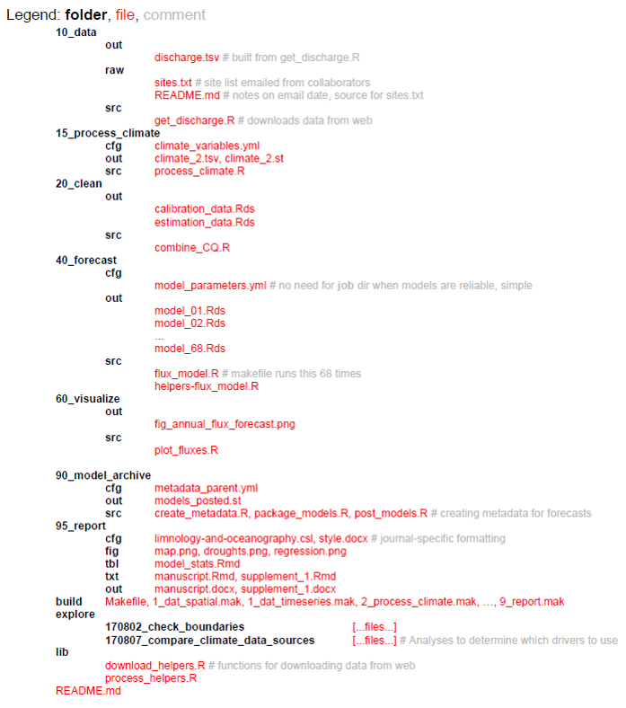

# Reproducible Forecasting Workflows  

updated: 2021-07-26 

## Overview  

Curators: Jake Zwart^1^, Alexey Shiklomanov^2^, Kenton McHenry^3^, Daniel S. Katz^3^, Rob Kooper^3^, Carl Boettiger^4^, Bryce Mecum^5^, Mike Dietze^6^, Quinn Thomas^7^

*^1^USGS, ^2^NASA, ^3^National Center for Supercomputing Applications at the University of Illinois Urbana-Champaign, ^4^University of California, Berkeley, ^5^National Center for Ecological Analysis and Synthesis, ^6^Boston University, ^7^Virginia Tech*

Reproducibility^8^ of scientific output is of utmost importance because it builds trust between stakeholders and scientists, increases scientific transparency, and often makes it easier to build upon methods and/or add new data to an analysis. Reproducibility is particularly critical when forecasting, because the same analyses need to be repeated again and again as new data become available, often in an automated workflow. Furthermore, reproducible workflows are essential to benchmark forecasting skill, improve ecological models, and analyze trends in ecological systems over time. All forecasting projects, from single location forecasts disseminated to only a few stakeholders to daily-updating continental-scale forecasts for public consumption, benefit from using tools and techniques that enable reproducible workflows. However, the project size often dictates which tools are most appropriate, and here we give a brief introductory overview of some of the tools available to help make your ecological forecast reproducible. There are many more tools available than what we describe here, and we primarily focus on open-source software to facilitate reproducibility independent of software access.

^8^ ***Reproducibility*** is the degree of agreement among results generated by at least two independent groups using the same suite of methods. Many of the tools highlighted here facilitate repeatability, which is a measure of agreement among results from a single task that is performed by the same person or tool. Repeatability is necessary for reproducible forecasting workflows. 

## Scripted Analysis   

Forecasts produced without using scripted analyses are often inefficient and prone to non-reproducible output. Therefore, it is best to perform data ingest and cleaning, modeling, data assimilation, and forecast visualization using a scripted computing language that perform tasks automatically once properly configured. 

### Tools for scripted analysis 

* *Interpreted languages* allow the user to execute commands line-by-line, interactively, in real time. This makes debugging and exploratory analysis much easier, and significantly reduces programmer time for performing analyses. Analyses using interpreted languages are also usually easier to reproduce because of fewer installation/configuration steps (and more standardized, centralized installation mechanisms). This convenience generally comes at the expense of computational speed, but many times the tradeoff is worth it.
    + [R](https://www.r-project.org/) – Originally developed for statistical computing, and still primarily used for data science and other scientific computing tasks. Many important data science tools, including statistical distributions, plotting, and tabular data analysis, are included in the core language. Tens of thousands of add-on [packages](http://r-pkgs.had.co.nz/) for just about any task imaginable exist.
    + [Python](https://www.python.org/) – General purpose programming language with a much more limited set of core features than R. Many data-science features are accessible through add-on [packages](https://packaging.python.org/) and are curated through repositories such as [PyPi](https://pypi.org/), [Anaconda](https://www.anaconda.com/), and [Enthought.](https://www.enthought.com/)
    + [Julia](https://julialang.org/) – Very recent language. Claims to combine the ease-of-use of interpreted languages like R and Python with the performance of compiled languages like C and Fortran. Specifically relevant to forecasting and uncertainty propagation, Julia has extremely powerful probabilistic programming tools (e.g. [Turing](https://turing.ml/dev/) for Bayesian inference, [Flux](https://fluxml.ai/) for machine learning).

* *Compiled languages* generally perform computationally intensive tasks much faster (up to 80x or more) than interpreted languages. However, their syntax is generally stricter / less forgiving, and analyses have to be written as complete programs that are compiled in operating system-specific (and even machine-specific) ways. In general, these languages should be avoided in favor of easier-to-use interpreted languages unless you are addressing specific computational bottlenecks. Note that all of the interpreted languages above provide ways to call specific functions/subroutines written in these compiled languages, so you have the option to only use these routines for specific, computationally-limiting steps in your analysis. Commonly used compiled languages include:
    + [C](https://www.learn-c.org/)
    + [C++](https://isocpp.org/)
    + [Fortran](https://ourcodingclub.github.io/tutorials/fortran-intro/)

* A good standard is to develop an analysis using an interpreted language first and assess if it is fast enough for your needs. If it is fast enough, then you are done! If not, do some [basic profiling](https://support.rstudio.com/hc/en-us/articles/218221837-Profiling-with-RStudio) to identify performance bottlenecks. See if there are existing tools or techniques in the language you are using that can help address the bottlenecks. Only fall back on compiled languages if you’ve reasonably exhausted possibilities using your current language.
* [List of programming languages](https://en.wikipedia.org/wiki/List_of_programming_languages_by_type)

## Project Structure   

Organized [project structures](https://docs.python-guide.org/writing/structure/) help the scientist and collaborators navigate the workflow of the ecological forecasting project from data input to dissemination of results. Subfolders should be used to break up the project into conceptually distinct steps of the forecasts and sequentially numbering of scripts and subfolders helps with readability, for example, “10_data”, “20_clean”, “40_forecast”, “60_visualize”, “95_report” (see more detailed example below).  The number prefixes should represent a conceptual workflow for each forecasting project, and subdirectories within each phase of the project should describe the inputs, outputs, and functions for each step. Generally, unnumbered directories should contain supporting files that apply to the overall project, for example a configuration file that is used in multiple phases of the forecasting project. 

### Tools for organized project structures      

* [Project-oriented workflows](https://www.r-bloggers.com/%F0%9F%93%81-project-oriented-workflow/) are self-contained workflows enabling reproducibility and navigability when used in conjunction with organized project structures for ecological forecasting projects. Ideally a collaborator should be able to run the entire project without changing any code or files (e.g. [file paths should be workstation-independent](https://www.tidyverse.org/blog/2017/12/workflow-vs-script/)). R and Python both have options for enabling self-contained workflows in their coding environments.
    + R – [RStudio projects](https://support.rstudio.com/hc/en-us/articles/200526207-Using-Projects) – R projects allow for analyses to be contained in a single working directory that can be given to a collaborator and run without changing file directory paths.
    + Python – [Spyder projects](https://docs.spyder-ide.org/projects.html) – Python projects also allow for self-contained analyses and integration with Git version control (see Version Control below).
    
    
## Version Control    

Version control is the process of managing changes in code and workflows and improves transparency in the code development process and facilitates open science and reproducibility. Code versioning also enables experimentation and development of code on different “branches” while retaining canonical files that can be used in operations, for example. Modern version control systems make it easy to create and switch between branches within a code base, encouraging developers to experiment without potentially breaking changes without worrying about losing stable code. This is especially useful for forecasting projects that need to make forecasts at regular schedules (e.g. daily), while researchers can also make alterations to the code base on experimental branches.  Finally, version control facilitates collaboration by formalizing the process for introducing changes and keeping a record of who introduced which changes, when, and why. Additionally, version control allows contributions in an open way from even unknown contributors with the opportunity for the main authors control which contributions are accepted. Software development is a trillion dollar industry and it is well worth the time learning the basics of industry standard tools like version control, rather than relying on ad hoc and error prone approaches such as file naming (e.g. script.v2.R, python_script_final_FINAL.py), Dropbox/Google Drive, or emailing files to collaborators.

### Tools for version control    

The distributed model of version control is where developers of code work from local repositories which are linked to a central repository. This enables automatic branching and merging, improves the ability to work offline, and doesn’t rely on a single repository for backup. 

* [Git](https://git-scm.com/) is the most popular open-source version control system among ecologists and also [professional software developers](https://en.wikipedia.org/wiki/Git#Adoption). The popularity enables contributions from many collaborators since potential contributors will likely be used to using Git and web interfaces like [GitHub](https://github.com/).
    + You can practice using Git for version control with some simple [tutorials](https://guides.github.com/activities/hello-world/).
    + [Rstudio has integrated support for GitHub](https://support.rstudio.com/hc/en-us/articles/200532077?version=1.0.153&mode=desktop)
    + [Spyder projects](https://docs.spyder-ide.org/projects.html#vcs-section) (Python) and Integrated Develop Environments such as [PyCharm](https://www.jetbrains.com/pycharm/) and [Visual Studio Code](https://code.visualstudio.com/) have integration with Git.
    + [GitLab](https://about.gitlab.com/) also uses Git, and similar to GitHub allows for issue tracking and various other project management tools, and GitLab provides more options for collaborator authentication.

.](images/git-version-control-workflow-example.png)  

[List of other version control programs](https://en.wikipedia.org/wiki/Comparison_of_version-control_software)

## Literate Programming      

Traditionally, scientific writing and coding are separate activities—for example, a researcher who wants to use code to generate a figure for her paper will have the code for generating that figure in one file and the document itself in another. This is a challenge for reproducibility and provenance tracking because both criteria have to be maintained for multiple files simultaneously. “Literate programming” provides an alternative approach, whereby code and text are interleaved within a single file; these files can be processed by special literate programming software to produce documents with the output of the code (e.g. figures, tables, and summary statistics) automatically interspersed with the document’s body text. This approach has several advantages. For one, the code output of a literate programming document is by definition guaranteed to be consistent with the code in the document’s source. At the same time, literate programming can make it easier to develop analyses by reducing the separation between writing and coding; for instance, interactive literate programming software can be used to keep “digital lab notebooks” where analyses are developed and described in the same file. In the context of ecological forecasting, literate programming techniques can be particularly useful for writing forecast software documentation, and can even be used for creating automatically-updating documents and reports describing forecast output.

### Tools for literate programming      

Two effective and common tools for literate programming are:

* [R Markdown](https://rmarkdown.rstudio.com/) — Allows code from multiple different languages including R, Python, SQL, C, and sh to be embedded within a common markup language (Markdown). Multiple different languages can be embedded within different blocks in the same document. Documents can be exported to a wide range of formats, including PDF, HTML, and DOCX. By default, R Markdown documents are static (i.e. the entire document is rendered all at once with a command); however, recent versions of RStudio allow them to be used interactively by rendering specific code blocks directly in the code editor window. R Markdown documents compiled to HTML format can easily embed interactive elements ranging from clickable plots and subsettable tables (e.g. [htmlwidgets](https://www.htmlwidgets.org/)) to full applications with user-defined inputs (via RShiny); for more information, stay tuned for our follow up task view on Visualization.
* [Jupyter](https://jupyter.org/) — Unlike R Markdown, these were designed from the start to be used interactively. Documents are stored in a format that makes them difficult to edit with a plain-text editor; rather, they are typically edited using a special browser-based editor that runs a language “kernel” in the background. The results of any particular code block are stored across sessions, so code blocks do not need to be re-evaluated when exporting to other formats. A document can only use a single language, with Julia, Python, and R supported.

## Workflows and Dependency Management     

Workflows are typically high-level descriptions of sets of tasks to be performed as part of an overall scientific application, at least in the context of this blog. There are a wide variety of methods and formats for expressing such descriptions. Workflows must include information about the tasks themselves, as well as their inputs and outputs, which either implicitly define or explicitly state dependencies among the tasks. This information, including the dependencies, is used by a Workflow Management System (WMS) to execute the tasks, potentially 1) on a local computer or one or more remote computers, including [clouds](https://en.wikipedia.org/wiki/Cloud_computing) and [HPC](https://en.wikipedia.org/wiki/Supercomputer) or [HTC](https://en.wikipedia.org/wiki/High-throughput_computing#:~:text=High%2Dthroughput%20computing%20(HTC),to%20accomplish%20a%20computational%20task.) systems; 2) serially or in parallel; 3) from the start or from a previous partially complete state. These dependencies can be static (fully defined before the application is run) or dynamic (e.g. partially defined based on data, execution, or other resources).

Workflow management systems help efficiently reproduce portions of or entire scientific workflows. These tools analyze workflows, skip phases of the workflow that are up-to-date (if the exact inputs and tasks have been run previously, the previous outputs can be returned; this technique is sometimes called [memoization](https://en.wikipedia.org/wiki/Memoization)), and execute tasks that are out-of-date, tasks downstream of out-of-date tasks, or tasks required to execute based on scheduled run times (e.g., daily-updating forecast). These tools are especially useful for large projects that bring multiple streams of data together in an analysis since it relieves the analyst from duties of keeping track of workflow order and tasks that need to be rerun. For example, when new data about a model parameter is included in the forecasting workflow, only the portion of the workflow dependent on that new data will be executed.

).](images/targets_dependency_graph.PNG)  

### Tools for workflows and dependency management

Below we list a few tools for workflows and dependency management.  There are however many other workflow and dependency management tools.  A larger list can be found [here](https://github.com/common-workflow-language/common-workflow-language/wiki/Existing-Workflow-systems).

* [Targets](https://books.ropensci.org/targets/) is an R-based ‘make’ like toolkit that tracks dependencies among phases of your workflow and executes work that is out-of-date. Targets builds upon previous R dependency managers such as [drake](https://github.com/ropensci/drake) and [remake](https://github.com/richfitz/remake), and can deal with high-performance or -throughput computing ([HPC](https://en.wikipedia.org/wiki/Supercomputer)/[HTC](https://research.cs.wisc.edu/htcondor/htc.html)) within the WMS framework. This includes automated detection and retries for model failures, and launching [Slurm](https://slurm.schedmd.com/overview.html) (or other [job schedulers](https://en.wikipedia.org/wiki/Job_scheduler) for HTC) jobs directly from a targets workflow. Additionally, there are built-in [cloud integration capabilities](https://books.ropensci.org/targets/cloud.html) to help scale larger compute projects. 
    + [Video tutorial and other Drake resources](https://ropensci.org/commcalls/2019-09-24/)
* [Snakemake](https://snakemake.readthedocs.io/en/stable/) is a Python-based workflow management tool that includes a lot of the same functionality as Drake for R, including being compatible with HPC / HTC or cloud computing environments. The rules defined in a Snakemake target can use shell or Python commands or run external Python or R scripts, as well as utilize various remote storage environments such as Amazon S3, Dropbox, or Google Storage.
* [Parsl](https://parsl-project.org/) is a Python library that lets users define a workflow through a Python program, or parallelize a Python program. They do this by ‘decorating’ the definition of Python functions and calls to external applications to indicate that they are potentially parallelizable and asynchronous tasks. When such a task is called, Parsl intercepts it and adds it to an internal dynamic directed acyclic graph that captures the overall application dependencies. If both the inputs for the task and execution resources are available, the task is run, and if not, it waits until these conditions are satisfied. In either case, Parsl immediately returns a ‘future’, a placeholder for the eventual return value, so that the overall application can proceed, which allows multiple tasks to run in parallel. Parsl is an open source project led by U Chicago & Illinois, which supports a wide variety of execution resources (e.g., local, CPUs, GPUs, HPC, HTC, cloud) and schedulers.
* [Pegasus](https://pegasus.isi.edu/) is another scientific workflow system with a long history of development and use in the science world (e.g., it’s the workflow system used by [LIGO](https://www.ligo.caltech.edu/))
* [Argo](https://argoproj.github.io/) is a more recent [kubernetes-based](https://kubernetes.io/) workflow system, convenient when much of the workflow is within docker already (see Containerization below).
* [Airflow](https://airflow.apache.org/) is another workflow system, developed and used by AirBnB and others, mostly in industry. Airflow is now a project within the [Apache Software Foundation](https://www.apache.org/). It allows a user to author workflows as [Directed Acyclic Graphs](https://en.wikipedia.org/wiki/Directed_acyclic_graph) (DAGs) of tasks. The Airflow scheduler executes the tasks on an array of workers while following the specified dependencies. It also has a user interface to allow the user to visualize pipelines running in production, monitor progress, and troubleshoot issues.

## Unit Testing   

Ecological forecasting workflows can be complex and involve many steps from data ingest, data cleaning, producing forecasts, to visualizing output. Often, these forecasting workflows need to produce output on a regular schedule and ensuring that each part of the workflow performs appropriately is crucial for making forecasts and identifying failure points, whether operational or not. Unit testing is automated tests on small units within a larger workflow to ensure that the different sections behave as intended (e.g. testing that individual functions return the expected outputs for valid inputs and the expected errors for invalid inputs). Frequently unit tests are also used for regression testing, where a test is created for a previous bug or problem that is fixed. The regression test is used to prevent a bug from being reintroduced. In combination with continuous integration (see below), these tests ensure that modifications to a code base run as expected after the modifications have been integrated.

In case of complex workflows or systems, a unit test will only test to make sure each of the components are working as intended. Additionally an integration or system test will need to be performed at certain points to test all the components interacting with each other. For example does each component still produce the outputs expected by the next steps in the workflow. 

### Tools for unit testing  

Most programming languages have a testing framework that will help with the unit tests. A list of tools [here](https://en.wikipedia.org/wiki/Unit_testing#Applications), some of the commonly used testing frameworks for tools used in forecasting are:

* [testthat](https://testthat.r-lib.org/) for R, including [examples](http://r-pkgs.had.co.nz/tests.html) of how to implement unit testing in R. 
* [pytest](https://docs.pytest.org/en/latest/) for Python

## Continuous Integration and Automation    

Both the models we use to make predictions and the forecasting workflows we build around them are, in some sense, always a work in progress. Any time we make changes to our models and workflows, whether it’s updating a library or adding a data source, there’s a chance that we’ll break our workflow. Tools for continuous integration enable researchers to update their forecasts and run tests on their code in an automated and robust manner (e.g. with system tests in place to check for accidental deployments that would otherwise break a deployment).  Continuous Integration (CI) tools automatically builds and deploys software ecosystems, and tests new versions of code to ensure development of models will work. This is especially important for iterative forecasts that need to be deployed at regular intervals (e.g. daily forecasts). As CI tools continue to become more powerful, flexible, and generous with their service offerings, they can expand from supporting development workflows to even be used as the primary platforms for application workflows, such as iterative, real-time forecasting.  Below we list few of these tools and a larger list can be found [here](https://github.com/ligurio/awesome-ci) or [here](https://en.wikipedia.org/wiki/Comparison_of_continuous_integration_software):

### Tools for continuous integration and automation  

* [Travis CI](https://travis-ci.com/plans?gclid=CjwKCAiAy9jyBRA6EiwAeclQhPqyrhYJ_vAV7Gw5tEcLOu5nXdk_ijOmanmS8cHXrK0ePRX1eoJevRoCrwEQAvD_BwE), Probably the most popular automated testing tool on GitHub, at least in the recent past.  This service is designed to test builds and run unit tests (and other, short-lived scripts) on a variety of different virtual platforms with different configurations.  Travic CI runs for free on its Travis CI servers, but has time and CPU limits (at least for the free version (though a user can request that these limits be increased).  Some features include the ability to run actions in parallel (configured via a YAML file) and an ability to be accessed via an API.
* [GitHub Actions](https://github.com/features/actions), similar to Travis CI, but hosted natively by GitHub and with more generous time, memory, and CPU allowances for open-source (public) projects on GitHub.  GitHub Actions is quickly increasing in popularity.
* [GitLab CI](https://about.gitlab.com/stages-devops-lifecycle/continuous-integration/), similar to Travis and GitHub Actions but hosted by GitLab.
* [Circle CI](https://circleci.com/), similar to Travis and GitHub Actions.
* [Jenkins](https://jenkins.io/), a locally run alternative that you can deploy on your own servers.

## Containerization    

Complex scientific workflows often involve combining multiple different tools written in different programming languages and/or possessing different software dependencies. Even a simple R script may depend on multiple R packages, and may only work as expected if specific versions of those packages are used. Managing these different tools and their dependencies can be a complex task, especially when tools conflict with each other (e.g. one tool may only work with an older version of a library, while another tool may only work with a newer version of the same library). As the number of tools and their dependencies in a workflow grows, managing these dependencies becomes challenging, and reproducing this workflow on a different machine (potentially with a different operating system) is even more challenging. **Containers** resolve these issues by providing a way to create isolated packages for each software element and its dependencies. These containers can then run on any computing environment (as long as it has the requisite container software itself installed). Moreover, containerization software sometimes allows for the creation of **container stacks** (a.k.a **“orchestration”**)— collections of multiple containers that communicate with each other (including sharing data) and with the host system in precise, user-defined ways (see Workflow and Dependency Management above). In some cases, these container stacks can be deployed across multiple physical or virtual computers, which greatly facilitates the process of scaling computationally intensive analyses.

### Tools for containerization        

By far the most common tool for containerization — indeed, the emerging standard across the software development industry — is [Docker](https://www.docker.com/). Docker containers are typically created from a [definition file](https://docs.docker.com/engine/reference/builder/), basically just a starting container (e.g. a specific version of a Linux operating system) followed by a list of shell commands describing the installation and configuration of the specified software and its dependencies. Thousands of existing containers (any of which can be used as a starting point for a custom container) for a wide range of software are available on [Docker Hub](https://hub.docker.com/), a publicly available registry. Software stacks and workflows using multiple containers can be created via [Docker Compose](https://docs.docker.com/compose/), which automatically configures and runs multiple interrelated Docker containers from a human-readable (YAML) [specification file](https://docs.docker.com/compose/compose-file/). Several tools for orchestration of Docker containers exist — [Docker Swarm](https://docs.docker.com/engine/swarm/) is distributed as part of Docker (i.e. no additional installation) and allows for rapid deployment with minimal configuration, while [Kubernetes](https://kubernetes.io/) is a much more complex but feature-rich solution. Another quickly maturing tool leveraging Docker is The [Binder Project](https://mybinder.org/), which is a relatively easy to use tool that turns a Git repository into a Docker image for deploying a reproducible computing environment in the cloud.

Unfortunately, Docker’s design precludes its use on high-performance computing clusters and other enterprise-managed machines often encountered in the sciences. In particular, running Docker containers requires running a persistent background process with administrative (“root”) privileges on the host machine. This is not an issue on self-managed, isolated physical (e.g. your personal laptop) and virtual (e.g. Amazon Web Services) machines. However, it ***does*** pose a major security concern that precludes its use on high-performance computing clusters and other enterprise-managed machines often encountered in the sciences. [Singularity](https://sylabs.io/singularity/) is an alternative that was designed specifically to address these concerns. Unlike Docker, Singularity does not require a persistent background process to run — rather, its design involves creating containers that are fully self-contained executable files. These files can then be distributed just like any other files, and executed on any machine (as long as that machine has a compatible version of Singularity installed). The initial install of Singularity, as well as the creation of containers, does require root permissions, but unlike Docker, the containers themselves run as a single process with only user permissions. Besides the security implications, this design also makes Singularity containers more amenable to HPC queue submission systems (running the containers is effectively the same as running any other executable). Like Docker, Singularity containers can be created via a [definition file](https://sylabs.io/guides/3.0/user-guide/build_a_container.html#building-containers-from-singularity-definition-files), and can be stored on a free, publicly available registry ([Singularity Hub](https://singularity-hub.org/)). The major downside of Singularity is that it has a much smaller user base (largely limited to a small subset of the scientific community, compared to Docker’s widespread use in both science and industry), and is much less mature software. For example, while Singularity does provide a [“Compose” interface](https://singularityhub.github.io/singularity-compose/#/), as of this writing this is still in early development and highly experimental. Singularity also works with Kubernetes.

## Metadata     

Metadata provide crucial information on the ecological forecasting data, including model input, output, and parameters, among others. Metadata tells the user how to interpret model output and what conditions are needed to reproduce output. Metadata is also used to describe the size and dimensions of the dataset, quality of the data, author of the data, keywords of the project used to produce the data, and details on how the data were produced. Appropriately documenting ecological forecasting output helps other researchers find relevant datasets and reuse output for other applications such as input to other models, or cross-model comparison such as a forecasting challenge.

### Tools for metadata     

* Ecological Metadata Language ([EML](https://eml.ecoinformatics.org/)) is a community-maintained project for documenting research data with a readable [XML](https://en.wikipedia.org/wiki/XML) markup syntax. EML serves the needs of the research community and is modularly designed to enable growth in the language as the needs of the earth and environmental sciences evolve. The Ecological Forecasting Initiative has developed additional forecast-specific standards using EML as the base metadata standards. The [EML R package](https://cran.r-project.org/web/packages/EML/index.html) facilitates generating an EML document, however, these documents can also be created using a text editor or other scripting languages such as Python.
* EFI is in the process of drafting an ecological forecasting metadata standard that extends EML. Current info is located in our [forecast-standards repo](https://github.com/cboettig/forecast-standards) and in the pre-prints list on the [EFI Publications webpage](https://ecoforecast.org/resources/ecological-forecasting-publications/).
* Many other metadata standards can be found [here](http://www.dcc.ac.uk/resources/metadata-standards/list).

## Data and Code Release    

A core principle of creating reproducible scientific workflows is making the code and data used in the analyses available to the public through data and code publication or releases. It is now often required by journals or institutions to [publish the data](https://www.force11.org/datacitationprinciples) used in scientific publications and to a lesser extent, [the code](https://www.force11.org/software-citation-principles) used in the analyses. Many of the other reproducible principles described above enable efficient data and code release and publication. For example, remote version control repositories, such as GitHub, display developmental and stable code bases and can [tag versions](https://git-scm.com/book/en/v2/Git-Basics-Tagging) of code to be [released](https://git-scm.com/book/en/v2/Git-Basics-Tagging) along with details on what the version was used for (e.g. “v1.2.1 used in analyses described by Dasari et al. 2019”). These code releases can also become [citable](https://guides.github.com/activities/citable-code/) with digital object identifier (DOI) by connecting with other archiving tools. Data releases should also be relatively painless if the previous principles of reproducible workflows are followed. Key to data releases and publishing in repositories are descriptive metadata that describe important characteristics of the dataset that is to be published (see Metadata section above). Additionally, embedding data publishing tasks (e.g. metadata descriptions, pushing data to a remote repository) in a dependency management system (see above) can make updating data in a public repository as easy as executing one line of code.

### Tools for data and code release    

* [Zenodo](https://zenodo.org/) – a general purpose open-access repository, often used with GitHub to publish software.
* [DataOne](https://www.dataone.org/) – a repository for environmental and ecological data.
* [Dryad](https://datadryad.org/stash) – a general purpose repository for research data.
* [Environmental Data Initiative](https://environmentaldatainitiative.org/) – a repository for environmental data.
* [ScienceBase](https://www.sciencebase.gov/catalog/) – an open-access data repository maintained by the US Geological Survey.
* [Open Science Framework (OSF)](https://osf.io/) – an open-access repository for research data.
* [Software Heritage Archive](https://archive.softwareheritage.org/) – a repository of open-access software.
* [Registry of Research Repositories](https://www.re3data.org/) – a collection of information about > 2000 research data repositories. 
